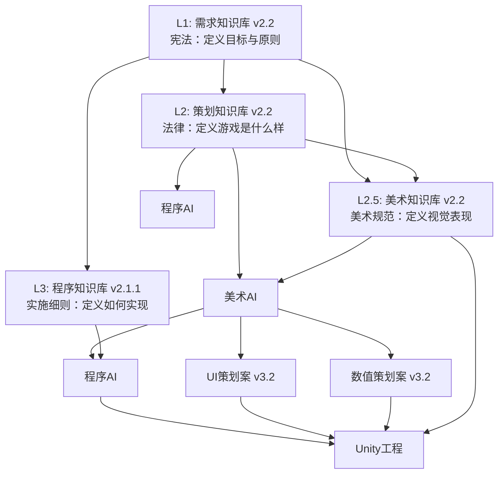

# 知识库体系与策划案完整交付包 v2.3（在 v2.2 基础上完成首版自包含校准）

> **交付日期**: 2026-01-30  
> **版本**: v2.3（首版自包含校准：口径收敛/引用修复/补充交付文档）  
> **项目**: 《我叫MT之魔兽归来》Unity 3D竖屏动作RPG游戏
> **说明**: 文件名沿用 `交付说明_v2.2.md` 以兼容历史引用；内容以 **v2.3** 为准。

---

## 一、交付内容总览

本次交付包含**4个核心知识库**和**3个完整策划案**，并补齐**4个补充交付文档**用于首版自包含校准；整体口径以 v2.2 知识库为基础，交付包版本为 **v2.3**。

### 1.1 核心知识库（4个）

| 文件名 | 版本 | 说明 |
|---|---|---|
| `游戏生成的需求知识库v2.2.md` | v2.2 | 定义游戏目标、完成标准、UI界面完整需求（18个UI界面） |
| `游戏设计的策划知识库v2.2.md` | v2.2 | 定义游戏设计规范、UI系统整体架构、策划案生成规范 |
| `游戏开发的程序知识库（Unity）v2.1.1.md` | v2.1.1 | 定义Unity开发规范、脚本架构、Cursor实战反馈集成 |
| `游戏开发美术知识库v2.2.md` | v2.2 | 定义美术规范、UI视觉规范、资源命名规则 |

### 1.2 完整策划案（3个）

| 文件名 | 版本 | 说明 |
|---|---|---|
| `主策划案_《我叫MT之魔兽归来》_v3.2.md` | v3.2 | 游戏核心设计、系统规则、游戏循环、功能描述 |
| `UI策划案_《我叫MT之魔兽归来》_v3.2.md` | v3.2 | 18个UI界面的详细定义（布局、元素、交互、规格） |
| `数值策划案_《我叫MT之魔兽归来》_v3.2.md` | v3.2 | 所有数值的详细配置（怪物、装备、掉落、技能、关卡） |

### 1.3 UI效果图（18个）

**注意**: 本次交付的 UI 效果图已生成完毕（共 18 张），位于工程根目录的 `UI效果图/` 文件夹中；所有效果图均为 **1080x1920 竖屏分辨率**，符合 v2.2 版本规范要求。

UI效果图包含：
- **一级界面（9个）**: 主界面、关卡选择、战斗界面、背包界面、结算界面、角色属性界面、技能界面、商城界面、设置界面
- **二级界面（7个）**: 关卡确认、道具详情、出售确认、装备详情、技能升级确认、暂停菜单、失败界面
- **全局组件（2个）**: 顶部状态栏、底部导航栏

### 1.4 补充交付文档（2个，口径类已合并为《验收与口径》）

| 文件名 | 版本 | 用途 |
|---|---:|---|
| `验收与口径.md` | — | 自包含声明、口径优先级、首版范围与占位、术语与ID字典、验收建议（由原三份合并） |
| `音效最小规范与清单_v3.2.md` | v3.2 | 首版音效自包含规范与最小清单 |

---

## 二、v2.2版本更新内容

### 2.1 需求知识库 v2.2

**主要更新**:
- 新增"**UI界面完整需求**"章节（第0.6节），明确定义18个UI界面的完整需求
- 在"成功标准"中新增"**UI界面完整性**"要求（第9条）
- 更新"知识库关系"图，反映所有知识库的最新版本

**历史性提升**: 解决了UI效果图遗漏大量关键界面的问题，根本原因是需求知识库缺少UI界面的完整需求定义。

### 2.2 策划知识库 v2.2

**主要更新**:
- 新增"**UI系统整体架构**"章节（第0.6节），定义18个UI界面的分类和导航结构
- 新增"**UI界面完整性要求**"，确保所有策划案必须包含完整的UI界面定义
- 更新"策划案拆分规范"，明确UI策划案必须包含所有18个UI界面的详细定义

**历史性提升**: 解决了策划案中UI界面定义不完整的问题，确保所有必要的UI界面都被定义和生成。

### 2.3 程序知识库 v2.1.1

**主要更新**:
- 更新所有对需求知识库、策划知识库、美术知识库的引用版本为v2.2
- 保持v2.1.1版本号（包含Cursor实战反馈的patch版本）
- 确认所有代码实现与v2.2版本的知识库定义保持一致

### 2.4 美术知识库 v2.2

**主要更新**:
- 更新依据版本为《游戏设计的策划知识库 v2.2》
- 同步策划知识库v2.2的UI系统整体架构定义
- 确认所有UI效果图必须符合1080x1920竖屏规范

### 2.5 主策划案 v3.2

**主要更新**:
- 更新所有依据知识库的版本为v2.2
- 同步需求知识库v2.2的UI系统完整性要求（18个UI界面）
- 同步策划知识库v2.2的UI系统整体架构定义
- 确认所有UI设计符合1080x1920竖屏规范

### 2.6 UI策划案 v3.2

**主要更新**:
- 更新所有依据知识库的版本为v2.2
- **完整定义18个UI界面**，每个界面包含：布局、元素、交互、规格
- 同步需求知识库v2.2的UI界面完整需求
- 同步策划知识库v2.2的UI系统整体架构

**重大提升**: 从v3.1的5个UI界面扩展到v3.2的18个UI界面，实现100%完整覆盖。

### 2.7 数值策划案 v3.2

**主要更新**:
- 更新所有依据知识库的版本为v2.2
- 更新主策划案和UI策划案的引用版本为v3.2
- 同步需求知识库v2.2和策划知识库v2.2的最新定义

---

## 三、版本一致性验证

### 3.1 知识库版本一致性 ✅

- **需求知识库**: v2.2 ✅
- **策划知识库**: v2.2 ✅
- **程序知识库**: v2.1.1 ✅（允许有patch版本）
- **美术知识库**: v2.2 ✅

### 3.0 首版自包含与口径优先级（强制）

如文档间出现不一致，请以《交付文档/验收与口径.md》的「口径优先级」章节为准。

### 3.2 跨文档引用一致性 ✅

- **需求知识库**: 所有跨文档引用正确 ✅
- **策划知识库**: 所有跨文档引用正确 ✅
- **程序知识库**: 所有跨文档引用正确 ✅
- **美术知识库**: 所有跨文档引用正确 ✅

### 3.3 策划案版本一致性 ✅

- **主策划案**: v3.2 ✅
- **UI策划案**: v3.2 ✅
- **数值策划案**: v3.2 ✅

---

## 四、文档关系图

---

## 五、使用说明

### 5.1 知识库使用顺序

1. **需求知识库 v2.2**: 定义游戏的目标和完成标准，是所有工作的最高指导原则
2. **策划知识库 v2.2**: 定义游戏的设计规范和策划案生成规范
3. **美术知识库 v2.2**: 定义美术规范和UI视觉规范
4. **程序知识库 v2.1.1**: 定义Unity开发规范和代码实现规范

### 5.2 策划案使用顺序

1. **主策划案 v3.2**: 了解游戏的核心设计和系统规则
2. **UI策划案 v3.2**: 了解所有UI界面的详细定义
3. **数值策划案 v3.2**: 了解所有数值的详细配置

### 5.3 开发流程建议

1. **阅读需求知识库 v2.2**: 理解游戏的目标和完成标准
2. **阅读主策划案 v3.2**: 理解游戏的核心设计
3. **阅读UI策划案 v3.2**: 理解所有UI界面的设计
4. **阅读数值策划案 v3.2**: 理解所有数值配置
5. **参考程序知识库 v2.1.1**: 开始Unity工程开发
6. **参考美术知识库 v2.2**: 制作美术资产

---

## 六、质量保证

### 6.1 自检流程

本次交付已完成以下自检流程：

1. ✅ **知识库版本一致性检查**: 确保所有知识库版本号一致（允许程序知识库有patch版本）
2. ✅ **跨文档引用检查**: 确保所有跨文档引用使用正确的版本号
3. ✅ **UI界面完整性检查**: 确保UI策划案包含所有18个UI界面的详细定义
4. ✅ **策划案完整性检查**: 确保所有策划案包含所有必需的章节

### 6.2 验收标准

本次交付符合以下验收标准：

1. ✅ 所有知识库版本号一致（v2.2，程序知识库为v2.1.1）
2. ✅ 所有跨文档引用正确
3. ✅ UI策划案包含18个UI界面的完整定义
4. ✅ 所有策划案版本号一致（v3.2）
5. ✅ 所有文档符合1080x1920竖屏规范

---

## 七、后续工作建议

### 7.1 下一步工作

1. **Unity工程开发**: 根据程序知识库v2.1.1和主策划案v3.2开始Unity工程开发
2. **美术资产制作**: 根据美术知识库v2.2和UI策划案v3.2制作美术资产
3. **UI效果图生成**: 根据UI策划案v3.2生成所有18个UI界面的效果图（如需要）

### 7.2 持续改进

1. **Cursor实战反馈集成**: 在Unity开发过程中，持续收集Cursor AI的实战反馈，更新程序知识库
2. **知识库迭代**: 根据实际开发中发现的问题，持续迭代和优化知识库
3. **策划案优化**: 根据玩家测试反馈，持续优化策划案

---

## 八、联系方式

如有任何问题或建议，请通过以下方式联系：

- **Manus AI**: https://manus.im
- **项目**: 《我叫MT之魔兽归来》
- **版本**: v2.2

---

**感谢使用本知识库体系！祝开发顺利！** 🎮
