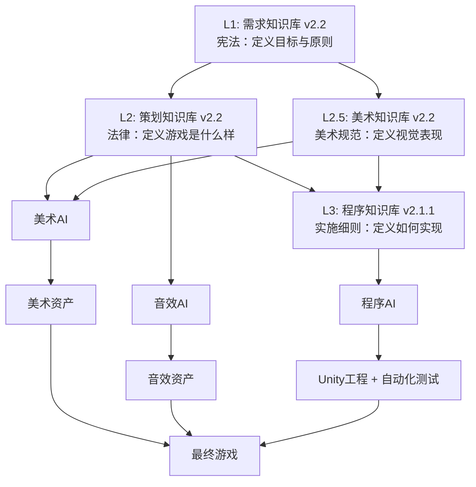

# 游戏生成的需求知识库 v2.2

**定位**: 本知识库是所有"AI 生成游戏"的上层约束与目标定义，是整个AI生成流程的"宪法"。

**依据**：《00_项目基础规范》《验收与口径》（游戏基础规范与 UI 清单以 00 为准，首版范围与术语以验收与口径为准）。  
**使用场景**：需求分析、成功标准制定、与策划案/知识库对照检查、AI 生成流程的顶层输入。

---

## 更新记录 (Changelog)

- **v2.2 (2026-01-30)**:
  - 新增"**UI界面完整需求**"章节（第0.6节），明确定义游戏应该包含哪些UI界面（一级界面、二级界面、全局组件）。
  - 在"成功标准"中新增"**UI界面完整性**"要求（第9条），确保所有必要的UI界面都已生成。
  - **历史性提升记录**: 本次更新基于2026-01-30的用户反馈，发现UI效果图遗漏了大量关键界面（角色属性、技能、商城、设置、二级界面、全局组件等），根本原因是需求知识库缺少UI界面的完整需求定义。此次更新补充了UI界面的完整需求，确保所有必要的UI界面都被定义和生成。
- **v2.1 (2026-01-30)**:
  - 新增"**游戏基础规范**"章节（第0章），明确定义游戏类型、屏幕方向、分辨率、Unity版本、平台等基础规范。
  - 在"成功标准"中新增"**游戏基础规范一致性**"要求（第8条），确保所有知识库、策划案、UI效果图都符合游戏基础规范。
  - **历史性提升记录**: 本次更新基于2026-01-29的实战反馈，发现知识库体系缺少"游戏基础规范"的明确定义，导致生成的UI效果图使用了错误的屏幕方向（横屏而非竖屏）。此次更新补充了游戏基础规范的强制定义，确保所有交付物都符合游戏的基础规范。
- **v2.0 (2026-01-30)**:
  - 基于《迷雾大陆》参考游戏分析和Cursor实战反馈进行全面升级。
  - 新增"游戏定位与核心吸引力"章节，明确游戏的核心吸引力、目标玩家、世界观、叙事方式。
  - 新增"UI/UX体验标准"章节，定义UI/UX的设计原则和体验要求。
  - 新增"参考标准"章节，明确以《迷雾大陆》为参考标准。
  - 新增"隐性知识显性化要求"章节，要求策划和美术知识库必须补充隐性知识。
  - 回答用户的10个核心疑问（核心吸引力、目标玩家、世界观、叙事方式、小地图、倒计时、治疗瓶、装备槽位、装备品质、装备库、关卡数量、自动战斗）。
- **v1.6 (2026-01-29)**:
  - 成功标准补充"可持续进度"要求：首版建议具备最小存档（金币/音量设置/背包穿戴等）。
  - 成功标准补充"奖励闭环"要求：击杀奖励需形成可感知链路（可见掉落→拾取→数值变化/背包刷新）。
- **v1.5 (2026-01-29)**:
  - **级联更新**：同步《策划知识库 v2.2》的新增内容。
  - 更新"成功标准"，增加对GDD完整性的要求（必须包含系统流程图、UI交互逻辑、配置数据结构等）。
  - 更新"知识库关系"图，反映策划知识库 v2.2、程序知识库 v2.1.1、美术知识库 v2.2 的版本。
- **v1.4 (2026-01-29)**:
  - 在"AI与人类协作框架"和"知识库关系"中正式引入**美术知识库**，形成四层知识库体系。
- **v1.3 (2026-01-28)**:
  - 在"成功标准"中新增"**测试闭环**"要求。
- **v1.2 (2026-01-28)**: 
  - 新增"美术AI与音效AI协作流程"章节。
- **v1.1 (2026-01-28)**: 明确了知识库的迭代规则和AI与人类的协作分工。
- **v1.0 (2026-01-28)**: 初始版本。

---

## 0. 游戏基础规范与 UI 界面需求

> **唯一口径**：游戏类型、屏幕、Unity 版本、平台、性能及 **18 个 UI 界面/组件清单** 均以 **《00_项目基础规范》** 为准，本知识库不再重复。  
> 路径：`知识库与策划案/00_项目基础规范.md`（与本文档同属知识库与策划案包）。  
> **本知识库在此处的职责**：需求侧「成功标准」中须包含「游戏基础规范一致性」「UI 界面完整性」；具体规范与清单见上文件。

### 0.6 UI界面完整需求（已迁至 00_项目基础规范 第6节，此处保留引用）

> **重要**: 本章节明确定义了游戏应该包含哪些UI界面，是所有策划知识库、UI策划案、UI效果图的最高约束。所有交付物必须严格遵循本章节定义的需求。

#### 0.6.1 一级界面（主要界面）

一级界面是游戏的主要功能界面，玩家可以通过全局导航或主界面按钮进入。

| 界面编号 | 界面名称 | 必须包含 | 说明 |
|---------|---------|---------|------|
| UI-01 | 主界面（开始游戏界面） | ✅ 是 | 游戏启动后的第一个界面，包含“开始游戏”按钮、设置入口、全局导航栏 |
| UI-02 | 关卡选择界面 | ✅ 是 | 选择要挑战的关卡，显示所有关卡的解锁状态和星级，包含全局导航栏 |
| UI-03 | 战斗界面 | ✅ 是 | 游戏核心玩法界面，包含虚拟摇杆、技能按钮、血条、经验条、暂停按钮、背包入口 |
| UI-04 | 背包界面 | ✅ 是 | 查看和管理物品，包含装备槽位、背包格子、出售按钮，包含全局导航栏 |
| UI-05 | 结算界面 | ✅ 是 | 关卡完成后的奖励展示，显示获得的经验、金币、装备，包含“返回主界面”按钮 |
| UI-06 | 角色属性界面 | ✅ 是 | 查看角色属性、等级、经验、装备，包含全局导航栏 |
| UI-07 | 技能界面 | ✅ 是 | 查看和升级技能，显示技能名称、等级、效果、升级按钮，包含全局导航栏 |
| UI-08 | 商城界面 | ✅ 是 | 购买道具、装备，显示商品名称、价格、购买按钮，包含全局导航栏 |
| UI-09 | 设置界面 | ✅ 是 | 音量、画质、语言等设置，包含全局导航栏 |

#### 0.6.2 二级界面（弹窗、确认界面）

二级界面是在一级界面之上弹出的界面，用于显示详细信息或确认操作。

| 界面编号 | 界面名称 | 必须包含 | 说明 |
|---------|---------|---------|------|
| UI-10 | 关卡确认界面 | ✅ 是 | 点击关卡后的确认进入界面，显示关卡名称、难度、奖励，包含“开始游戏”和“取消”按钮 |
| UI-11 | 道具详情界面 | ✅ 是 | 点击背包中的道具后显示详情，包含道具名称、描述、效果、“使用”和“出售”按钮 |
| UI-12 | 出售确认界面 | ✅ 是 | 确认出售道具的二级界面，显示道具名称、出售价格，包含“确认”和“取消”按钮 |
| UI-13 | 装备详情界面 | ✅ 是 | 点击装备后显示详情，包含装备名称、属性、品质、“穿戴”和“卸下”按钮 |
| UI-14 | 技能升级确认界面 | ✅ 是 | 确认升级技能的二级界面，显示技能名称、升级消耗、升级后效果，包含“确认”和“取消”按钮 |
| UI-15 | 暂停菜单 | ✅ 是 | 战斗中暂停后的菜单，包含“继续游戏”、“设置”、“退出关卡”按钮 |
| UI-16 | 失败界面 | ✅ 是 | 玩家死亡后的失败界面，显示“失败”文字，包含“重新开始”和“返回主界面”按钮 |

#### 0.6.3 全局组件

全局组件是在多个界面中都会出现的UI元素，用于提供全局导航和状态显示。

| 组件编号 | 组件名称 | 必须包含 | 说明 |
|---------|---------|---------|------|
| COMP-01 | 主菜单栏（底部导航栏） | ✅ 是 | **首版（v3.2 + UI效果图口径）**：底部导航栏包含 **“主页 / 背包 / 商城 / 设置”** 4 个入口；“角色属性/技能”入口在主界面（UI-01）提供按钮进入；“退出”入口放在设置（UI-09）或二级确认弹窗中。后续版本可扩展为 6 入口（角色/背包/技能/商城/设置/退出）。 |
| COMP-02 | 顶部状态栏 | ✅ 是 | 在多个界面顶部显示。**首版必须显示金币与等级/头像信息**；钻石/体力为**预留字段**（可显示为 0 或隐藏，不进入首版验收的功能要求）。 |

#### 0.6.4 UI界面完整性要求

- **一级界面**: 所有一级界面（UI-01至UI-09）必须全部生成
- **二级界面**: 所有二级界面（UI-10至UI-16）必须全部生成
- **全局组件**: 所有全局组件（COMP-01至COMP-02）必须在相应界面中显示
- **交互完整性**: 每个可点击的元素都应该有对应的二级界面或反馈

---

## 1. 总体目标与成功标准

### 1.1 核心目的

-   **最终目的**: **在 Unity 中，玩家可以真实地玩到一个具备核心循环、良好反馈且无致命错误的单局游戏体验**。
-   **过程性目标**: 将人类从"机械修错"中解放出来，专注于"体验评估"和"设计决策"，最大化AI的自动化开发能力。

### 1.2 成功标准（可玩Demo的最低要求）

一次"自检通过"的AI交付版本，必须满足以下所有条件：

1.  **流程完整**: 玩家可以从打开游戏开始，无障碍地完成"主界面 → 选择关卡 → 战斗 → 结算 → 返回主界面"的完整核心循环。
2.  **战斗有效**: 关卡内有足够数量的怪物，玩家可以控制角色进行有效的移动、攻击和技能释放，并能通过战斗获得明确的奖励（经验、金币、装备），且奖励应形成可感知闭环（击杀→掉落→拾取→背包/数值变化）。
3.  **反馈明确**: 攻击有打击感，怪物和玩家的死亡有清晰的视听反馈，UI按钮响应及时。
4.  **无致命错误**: 游戏全程无崩溃、黑屏、卡死或关键对象（玩家、怪物、UI）缺失等阻碍游戏进行的问题。
5.  **测试闭环**: 程序AI必须依据GDD中的《游戏功能验收测试SOP》生成并成功执行自动化测试（如Unity PlayMode Test），确保核心游戏流程符合策划预期。
6.  **GDD完整性**: 策划AI生成的GDD必须包含以下所有关键内容，确保程序AI和美术AI能够直接执行：
    -   游戏状态机与流程图
    -   所有UI界面的结构定义、交互逻辑和状态刷新规则
    -   系统间协作与数据流转规则
    -   完整的配置数据结构定义（JSON格式）
    -   游戏功能验收测试SOP
7.  **可持续进度**: 首版建议具备最小存档能力，至少包括**音量设置**与**金币/基础进度**（可扩展：背包与穿戴），避免回主界面或重启后"丢进度"影响可玩性评估。
8.  **游戏基础规范一致性** (New in v2.1): 所有知识库、策划案、UI效果图、关卡设计图必须严格遵循“第0章：游戏基础规范”中定义的所有规范，包括但不限于：
    -   **屏幕方向**: 所有UI效果图、UI布局图必须使用竖屏（Portrait）布局
    -   **分辨率**: 所有UI效果图、UI布局图必须使用1080x1920分辨率
    -   **Unity版本**: 所有程序知识库、程序开发计划必须明确使用Unity 2022.3.47f1
    -   **平台**: 所有知识库、策划案必须明确目标平台为iOS + Android
9.  **UI界面完整性** (New in v2.2): 所有UI策划案、UI效果图必须严格遵循“第0.6节：UI界面完整需求”中定义的所有需求，包括但不限于：
    -   **一级界面**: 所有一级界面（UI-01至UI-09）必须全部生成
    -   **二级界面**: 所有二级界面（UI-10至UI-16）必须全部生成
    -   **全局组件**: 所有全局组件（COMP-01至COMP-02）必须在相应界面中显示
    -   **交互完整性**: 每个可点击的元素都应该有对应的二级界面或反馈

---

## 2. 游戏定位与核心吸引力

### 2.1 核心吸引力

**我们的游戏的核心吸引力是**：
1. **刷刷刷的爽快感**: 大量怪物、快速战斗、流畅打击感
2. **装备掉落的惊喜感**: 频繁的装备掉落、明显的品质区分、即时的属性提升
3. **角色成长的满足感**: 明显的数值成长、技能解锁、装备升级

### 2.2 目标玩家

**我们的游戏的目标玩家是**：
- **中度玩家**：有一定RPG经验，喜欢刷刷刷和装备掉落
- **单局时长**: 3-5分钟（适合碎片时间游戏）
- **操作难度**: 中等（虚拟摇杆 + 技能按钮，支持自动战斗）

### 2.3 世界观

**我们的游戏的世界观是**：
- **魔兽世界风格的奇幻世界**：兽人、精灵、矮人、亡灵等经典种族
- **轻松幽默的风格**：参考《我叫MT》系列，不是严肃的史诗故事

### 2.4 叙事方式

**我们的游戏的叙事方式是**：
- **轻叙事**：简单的背景故事，主要通过关卡名称和BOSS名称来传达世界观
- **无剧情对话**：首版不包含剧情对话，专注于战斗体验

---

## 3. UI/UX体验标准

### 3.1 UI/UX设计原则

1. **信息分区**: UI布局应该遵循"信息分区"原则，让玩家能够快速找到需要的信息
2. **交互一致性**: 所有UI交互应该保持一致，避免玩家困惑
3. **简单性**: UI应该简单明了，避免过多的装饰和复杂的交互
4. **设计一致性**: 所有UI元素应该保持一致的视觉风格
5. **沉浸感**: UI应该尽量不打断玩家的游戏体验

### 3.2 UI/UX体验要求

1. **界面切换**: 所有界面切换应该有流畅的动画效果（淡入淡出、缩放等）
2. **Loading**: 所有需要加载的地方都应该有Loading界面，避免黑屏或卡顿
3. **反馈**: 所有UI交互都应该有明确的反馈（按钮按下效果、音效、震动等）
4. **引导**: 新手教程应该有明确的引导（箭头、高亮、文字提示等）

---

## 4. 参考标准

### 4.1 参考游戏

**我们的游戏以《迷雾大陆》为参考标准**，确保我们的游戏至少达到《迷雾大陆》的水平。

### 4.2 参考内容

1. **UI布局**: 参考《迷雾大陆》的UI布局（战斗界面、背包界面、关卡选择界面等）
2. **战斗体验**: 参考《迷雾大陆》的战斗体验（怪物数量、战斗节奏、打击感等）
3. **装备系统**: 参考《迷雾大陆》的装备系统（装备品质、装备槽位、装备升级等）
4. **关卡设计**: 参考《迷雾大陆》的关卡设计（关卡数量、难度曲线、BOSS设计等）

---

## 5. 隐性知识显性化要求

### 5.1 核心要求

**策划知识库和美术知识库必须包含详细的隐性知识补充**，将"人类程序员和美术都知道，但AI不知道"的常识、经验、惯例显性化。

### 5.2 具体要求

1. **策划知识库**: 必须补充"游戏设计的标准机制"（如背包如何打开、装备如何穿戴、装备品质如何区分等）
2. **美术知识库**: 必须补充"美术设计的标准规范"（如装备品质颜色、"新"标签、"可升级"提示等）
3. **程序知识库**: 必须补充"Unity开发的基本常识"（如Camera、AudioListener、单例时序问题等）

---

## 6. AI与人类协作框架

### 6.1 角色分工

- **人类 (产品经理/主策)**: 定义顶层需求（本知识库），迭代核心设计（策划、美术知识库），进行最终体验评估。
- **策划AI**: 依据本知识库，生成和维护《游戏设计的策划知识库》和具体的GDD。
- **美术AI**: 依据策划和美术知识库，生成所有美术资产。
- **程序AI**: 依据策划、美术和程序知识库，生成完整的Unity工程。
- **音效AI**: (暂时不变)

### 6.2 美术AI与音效AI协作流程

> **原则**: 美术AI和音效AI是内容生成的核心，它们的产出必须严格遵循策划知识库、美术知识库和具体GDD的约束。程序AI必须等待美术和音效资产生成完毕后，才能进行最终的集成和打包。

1.  **触发时机**: 在GDD生成并确认后，开发执行清单中应包含明确的"生成美术资产"和"生成音效资产"步骤。
2.  **输入**: 
    -   《游戏开发美术知识库 v2.2》中的视觉基调和资源规范。
    -   《游戏设计的策划知识库》中的美术和音效需求约束。
    -   GDD中的具体美术/音效资产清单（包含名称、描述、用途等）。
3.  **执行**: 美术AI和音效AI根据输入，独立、并行地生成所有需要的资源。
4.  **输出**: 
    -   符合知识库规范的、命名和目录结构清晰的资产包（如 `Art_Assets.zip`, `Audio_Assets.zip`）。
5.  **自检**: AI在交付前必须自检，确保所有资产的格式、尺寸、命名等符合知识库规范。

---

## 7. 四层知识库关系

**说明**：
- **0 章与 UI 清单**：游戏基础规范及 18 个 UI 界面/组件清单以 **《00_项目基础规范》** 为唯一口径，各知识库 0 章均引用该文件，不再重复定义。
- **L1 (需求知识库)**: 定义项目的最高目标和成功标准，是所有知识库的"宪法"。
- **L2 (策划知识库)**: 定义游戏的玩法、系统、流程、UI交互等具体设计，是策划AI的工作成果。
- **L2.5 (美术知识库)**: 定义游戏的视觉风格、美术资源规范、UI视觉标准等，是美术AI的工作依据。
- **L3 (程序知识库)**: 定义Unity工程的技术实现规范、代码结构、自动化测试等，是程序AI的工作依据。

---

## 8. 迭代与沉淀

每一次"从0到可玩Demo"的完整尝试，都应产出问题与根因总结，并作为修订建议反馈给本知识库。通过持续迭代，本知识库将逐步稳定，成为未来所有"AI生成游戏"项目的上层模板。
