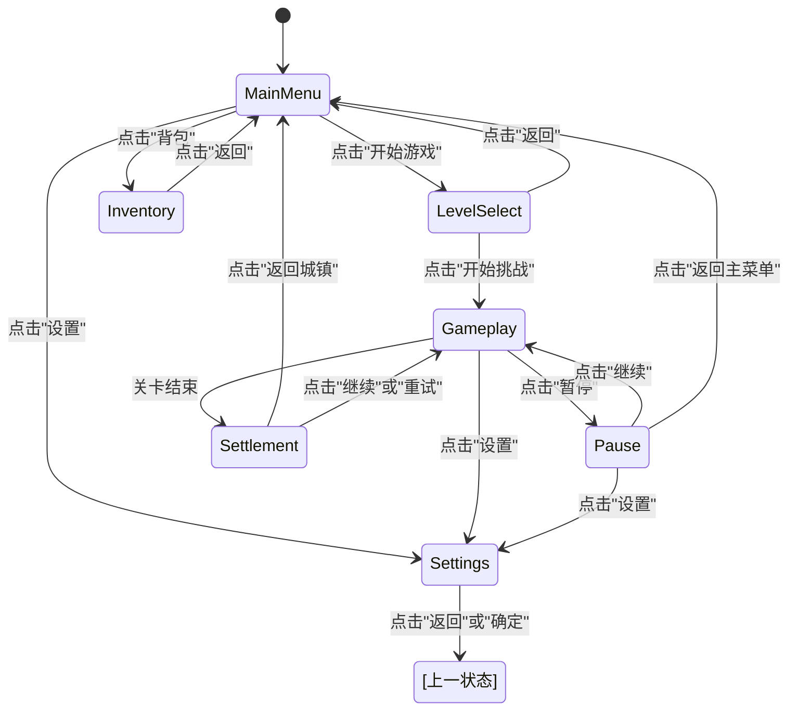

# UI策划案_《我叫MT之魔兽归来》_v3.2

> **版本**: 3.2  
> **日期**: 2026-01-30  
> **依据**:
> - 《游戏生成的需求知识库 v2.2》
> - 《游戏设计的策划知识库 v2.2》
> - 《游戏开发美术知识库 v2.2》
> - 《主策划案_《我叫MT之魔兽归来》_v3.2.md》
> - 《参考游戏：迷雾大陆》

> **说明**:
> - 本文档为**UI策划案**，定义所有UI界面的详细布局图、交互设计、视觉规范
> - **游戏核心设计**请参考《主策划案_《我叫MT之魔兽归来》_v3.2.md》
> - **数值详细配置**请参考《数值策划案_《我叫MT之魔兽归来》_v3.2.md》
> - **交付包自包含与口径优先级**：见《交付文档/验收与口径.md》。文中若出现“基础知识库 v1.8”，仅为历史来源，不要求读取。

---

## 更新记录 (Changelog)

- **v3.2 (2026-01-30)**（UI界面完整性修正）:
  - **重大更新**：根据用户反馈，补充遗漏的UI界面和组件
  - 新增4个一级界面：角色属性界面、技能界面、商城界面、设置界面（完整版）
  - 新增7个二级界面：关卡确认界面、道具详情界面、出售确认界面、装备详情界面、技能升级确认界面、暂停菜单（完整版）、失败界面
  - 新增2个全局组件：主菜单栏（底部导航栏）、顶部状态栏
  - 更新所有依据知识库的版本为v2.2
  - 更新主策划案和数值策划案的引用版本为v3.2
  - 总计18个UI界面/组件（9个一级界面 + 7个二级界面 + 2个全局组件）
- **v3.1 (2026-01-30)**（知识库版本同步）:
  - 更新所有依据知识库的版本为v2.1
  - 同步《游戏基础规范》（第0章）的强制定义
  - **重要修正**: 确认所有UI布局图必须使用竖屏（Portrait）1080x1920分辨率
  - 更新主策划案和数值策划案的引用版本为v3.1
- **v3.0 (2026-01-30)**（UI策划案独立）:
  - **重大更新**：根据《策划知识库 v2.2》的"策划案拆分规范"，将UI部分从主策划案中独立出来
  - **UI策划案定位**：定义所有UI界面的详细布局图、交互设计、视觉规范
  - **新增内容**：所有UI界面的详细布局图（ASCII图示）
  - **新增内容**：装备库（背包）界面设计（30格）
  - **新增内容**：治疗瓶UI设计（初始3瓶）
  - **参考标准**：基于《迷雾大陆》游戏分析，补充UI隐性知识和设计原则

---

## 目录

1. [UI设计原则](#1-ui设计原则)
2. [UI视觉规范](#2-ui视觉规范)
3. [主界面 (UIMainMenu)](#3-主界面-uimainmenu)
4. [关卡选择界面 (UILevelSelect)](#4-关卡选择界面-uilevelselect)
5. [战斗界面 (UIGameplay)](#5-战斗界面-uigameplay)
6. [暂停界面 (UIPause)](#6-暂停界面-uipause)
7. [结算界面 (UISettlement)](#7-结算界面-uisettlement)
8. [背包界面 (UIInventory)](#8-背包界面-uiinventory)
9. [设置界面 (UISettings)](#9-设置界面-uisettings)
10. [UI交互逻辑详细设计](#10-ui交互逻辑详细设计)
11. [UI反馈系统详细设计](#11-ui反馈系统详细设计)
12. [UI状态管理详细设计](#12-ui状态管理详细设计)

---

## 1. UI设计原则

> **原则**: 这是所有UI设计的最高"宪法"，后续所有UI界面都必须严格遵守。

### 1.1 核心设计原则

**信息分区原则**: UI界面应该按照功能和重要性进行分区，让玩家能够快速找到需要的信息

**视觉层次原则**: UI界面应该有清晰的视觉层次，重要信息应该更突出

**一致性原则**: 相同类型的UI元素应该有相同的样式和交互方式

**简洁性原则**: UI界面应该尽可能简洁，避免信息过载

**沉浸感原则**: UI界面应该与游戏世界观保持一致，不破坏沉浸感

**参考标准**: 《迷雾大陆》的UI设计（暗黑奇幻、石质边框、金属装饰、信息分区清晰）

### 1.2 UI布局黄金分割

**屏幕分区**:
- **左上角**: 玩家信息（头像、血条、资源条）
- **右上角**: 游戏信息（金币、设置按钮）
- **左下角**: 移动控制（虚拟摇杆）
- **右下角**: 战斗控制（技能按钮）
- **中央**: 游戏画面（不被UI遮挡）
- **中央上方**: 重要提示（如关卡目标、倒计时）
- **中央下方**: 次要提示（如拾取物品、经验获得）

### 1.3 UI安全区

**安全区定义**: 所有重要的UI元素都应该在安全区内，避免被屏幕刘海、圆角、手势条遮挡

**安全区边距**:
- **顶部**: 100px
- **底部**: 100px
- **左右**: 40px

> **一致性说明**：为避免跨文档验收口径冲突，安全区以“上下各 100px”为首版硬约束（与需求/策划/程序/美术知识库第0章一致）。如后续适配全面屏手势条，可在实现层做机型自适应，但文档验收仍以 100px 为基线。

---

## 2. UI视觉规范

### 2.1 UI风格

**整体风格**: 暗黑奇幻，石质边框，金属装饰

**色彩方案**:
- **主色调**: 深灰色（#2A2A2A）、石质纹理
- **强调色**: 金色（#FFD700）、橙色（#FF8C00）
- **警告色**: 红色（#FF0000）
- **成功色**: 绿色（#00FF00）

**字体规范**:
- **标题字体**: 粗体，32-48px
- **正文字体**: 常规，24-28px
- **小字字体**: 常规，18-20px

### 2.2 UI元素规范

**按钮规范**:
- **正常态**: 石质纹理，金色边框
- **按下态**: 石质纹理，金色边框，内阴影
- **禁用态**: 石质纹理，灰色边框，半透明

**血条规范**:
- **背景**: 深灰色（#2A2A2A）
- **填充**: 红色渐变（#FF0000 → #CC0000）
- **边框**: 金色（#FFD700）

**经验条规范**:
- **背景**: 深灰色（#2A2A2A）
- **填充**: 黄色渐变（#FFD700 → #FFA500）
- **边框**: 金色（#FFD700）

**装备品质颜色**:
- **普通**: 灰色（#808080）
- **稀有**: 蓝色（#0080FF）
- **史诗**: 紫色（#A020F0）
- **传说**: 橙色（#FF8C00）

### 2.3 UI图标规范

**图标尺寸**:
- **大图标**: 120x120px（技能按钮、装备图标）
- **中图标**: 80x80px（物品图标）
- **小图标**: 64x64px（金币、经验图标）
- **迷你图标**: 30x30px（箭头、感叹号）

**图标风格**: 3D渲染，带有高光和阴影，与游戏世界观保持一致

---

## 3. 主界面 (UIMainMenu)

### 3.1 界面信息

**界面ID**: `UIMainMenu`  
**界面名称**: 主界面  
**界面层级**: 主界面层 (Main)  
**界面状态**: 游戏启动后默认显示

### 3.2 界面布局图

```
┌─────────────────────────────────────────────────────────────────┐
│                        [游戏Logo/标题]                            │  ← 顶部，居中
│                                                                   │
│                                                                   │
│                                                                   │
│                     ┌─────────────────┐                          │
│                     │   [玩家头像]    │                          │  ← 中上，居中
│                     │   Lv.15 猎人    │                          │
│                     └─────────────────┘                          │
│                                                                   │
│                     ┌─────────────────┐                          │
│                     │  [开始游戏]     │                          │  ← 中央，主按钮
│                     └─────────────────┘                          │
│                                                                   │
│                     ┌─────────────────┐                          │
│                     │  [继续游戏]     │                          │  ← 中央，次按钮
│                     └─────────────────┘                          │
│                                                                   │
│  ┌─────────┐                                   ┌─────────┐      │
│  │ [背包]  │                                   │ [设置]  │      │  ← 底部，左右对称
│  └─────────┘                                   └─────────┘      │
│                                                                   │
│  [金币图标] 12,345                                               │  ← 左下角
│                                                                   │
└─────────────────────────────────────────────────────────────────┘
```

### 3.3 UI元素列表

| 元素ID | 元素类型 | 位置 | 尺寸 | 功能描述 |
|---|---|---|---|---|
| `Logo_GameTitle` | Image | 顶部居中 | 600x200 | 游戏Logo或标题 |
| `Panel_PlayerInfo` | Panel | 中上居中 | 300x150 | 玩家信息面板（头像、等级、职业） |
| `Image_PlayerAvatar` | Image | Panel内 | 100x100 | 玩家头像 |
| `Text_PlayerLevel` | Text | Panel内 | - | 玩家等级（如"Lv.15"） |
| `Text_PlayerClass` | Text | Panel内 | - | 玩家职业（如"猎人"） |
| `Button_StartGame` | Button | 中央居中 | 400x120 | 开始游戏按钮 |
| `Button_Continue` | Button | 中央居中 | 400x120 | 继续游戏按钮 |
| `Button_Inventory` | Button | 底部左侧 | 200x100 | 打开背包界面 |
| `Button_Settings` | Button | 底部右侧 | 200x100 | 打开设置界面 |
| `Image_GoldIcon` | Image | 左下角 | 64x64 | 金币图标 |
| `Text_Gold` | Text | 左下角 | - | 当前金币数（如"12,345"） |

### 3.4 交互逻辑

| 元素ID | 交互类型 | 触发条件 | 行为 |
|---|---|---|---|
| `Button_StartGame` | 点击 | 无 | 进入关卡选择界面 |
| `Button_Continue` | 点击 | 有存档 | 继续上次进度，直接进入上次关卡 |
| `Button_Continue` | 点击 | 无存档 | 按钮禁用，无反应 |
| `Button_Inventory` | 点击 | 无 | 打开背包界面 |
| `Button_Settings` | 点击 | 无 | 打开设置界面 |

### 3.5 视觉反馈

| 元素ID | 反馈类型 | 触发条件 | 效果 |
|---|---|---|---|
| `Button_StartGame` | 按下态 | 按下按钮 | 按钮显示按下态，播放点击音效 |
| `Button_Continue` | 禁用态 | 无存档 | 按钮显示禁用态（灰色、半透明） |
| `Button_Inventory` | 按下态 | 按下按钮 | 按钮显示按下态，播放点击音效 |
| `Button_Settings` | 按下态 | 按下按钮 | 按钮显示按下态，播放点击音效 |

---

## 4. 关卡选择界面 (UILevelSelect)

### 4.1 界面信息

**界面ID**: `UILevelSelect`  
**界面名称**: 关卡选择界面  
**界面层级**: 主界面层 (Main)  
**界面状态**: 点击"开始游戏"后显示

### 4.2 界面布局图

```
┌─────────────────────────────────────────────────────────────────┐
│  [返回] ←                  [关卡选择]                            │  ← 顶部，标题居中，返回按钮左上
│                                                                   │
│                                                                   │
│  ┌─────────┐  ┌─────────┐  ┌─────────┐  ┌─────────┐            │
│  │ 第1关   │  │ 第2关   │  │ 第3关   │  │ 第4关   │            │  ← 关卡列表，横向排列
│  │ [图标]  │  │ [图标]  │  │ [图标]  │  │ [锁]    │            │
│  │ 简单    │  │ 简单    │  │ 普通    │  │ 普通    │            │
│  └─────────┘  └─────────┘  └─────────┘  └─────────┘            │
│                                                                   │
│  ┌─────────┐  ┌─────────┐  ┌─────────┐  ┌─────────┐            │
│  │ 第5关   │  │ 第6关   │  │ 第7关   │  │ 第8关   │            │
│  │ [锁]    │  │ [锁]    │  │ [锁]    │  │ [锁]    │            │
│  │ 困难    │  │ 困难    │  │ 困难    │  │ 地狱    │            │
│  └─────────┘  └─────────┘  └─────────┘  └─────────┘            │
│                                                                   │
│  ┌─────────┐  ┌─────────┐                                       │
│  │ 第9关   │  │ 第10关  │                                       │
│  │ [锁]    │  │ [锁]    │                                       │
│  │ 地狱    │  │ 地狱    │                                       │
│  └─────────┘  └─────────┘                                       │
│                                                                   │
│                                                                   │
│              ┌─────────────────────────┐                         │
│              │  [选中关卡：第1关]      │                         │  ← 底部，关卡详情面板
│              │  难度：简单              │                         │
│              │  推荐等级：1-3           │                         │
│              │  [开始挑战]             │                         │
│              └─────────────────────────┘                         │
│                                                                   │
└─────────────────────────────────────────────────────────────────┘
```

### 4.3 UI元素列表

| 元素ID | 元素类型 | 位置 | 尺寸 | 功能描述 |
|---|---|---|---|---|
| `Button_Back` | Button | 左上角 | 150x80 | 返回主界面 |
| `Text_Title` | Text | 顶部居中 | - | 标题"关卡选择" |
| `Button_Level_1` | Button | 关卡列表 | 200x200 | 第1关按钮（已解锁） |
| `Button_Level_2` | Button | 关卡列表 | 200x200 | 第2关按钮（已解锁） |
| `Button_Level_3` | Button | 关卡列表 | 200x200 | 第3关按钮（已解锁） |
| `Button_Level_4~10` | Button | 关卡列表 | 200x200 | 第4-10关按钮（未解锁，显示锁图标） |
| `Panel_LevelDetail` | Panel | 底部居中 | 600x300 | 关卡详情面板 |
| `Text_LevelName` | Text | Panel内 | - | 选中关卡名称（如"第1关"） |
| `Text_Difficulty` | Text | Panel内 | - | 关卡难度（如"简单"） |
| `Text_RecommendLevel` | Text | Panel内 | - | 推荐等级（如"1-3"） |
| `Button_StartChallenge` | Button | Panel内 | 400x120 | 开始挑战按钮 |

### 4.4 交互逻辑

| 元素ID | 交互类型 | 触发条件 | 行为 |
|---|---|---|---|
| `Button_Back` | 点击 | 无 | 返回主界面 |
| `Button_Level_1~3` | 点击 | 已解锁 | 选中该关卡，更新关卡详情面板 |
| `Button_Level_4~10` | 点击 | 未解锁 | 播放"无法选择"的提示音效，可选显示提示文本"完成前置关卡后解锁" |
| `Button_StartChallenge` | 点击 | 已选中关卡 | 进入Loading状态，加载选中的关卡 |

### 4.5 视觉反馈

| 元素ID | 反馈类型 | 触发条件 | 效果 |
|---|---|---|---|
| `Button_Level_1~3` | 选中态 | 点击按钮 | 按钮显示选中态（金色边框加粗） |
| `Button_Level_4~10` | 禁用态 | 未解锁 | 按钮显示禁用态（灰色、半透明、锁图标） |
| `Button_StartChallenge` | 按下态 | 按下按钮 | 按钮显示按下态，播放点击音效 |

---

## 5. 战斗界面 (UIGameplay)

### 5.1 界面信息

**界面ID**: `UIGameplay`  
**界面名称**: 战斗界面  
**界面层级**: 主界面层 (Main)  
**界面状态**: 进入战斗场景后显示

### 5.2 界面布局图

```
┌─────────────────────────────────────────────────────────────────┐
│  ┌─────────────────┐                         [金币] 12,345      │  ← 左上：玩家信息，右上：金币、设置
│  │ [头像] Lv.15    │                         [设置] [暂停]      │
│  │ ████████░░ 80%  │  ← 血条                                    │
│  └─────────────────┘                                             │
│                                                                   │
│                                                                   │
│                      [游戏画面区域]                              │  ← 中央：游戏画面（不被UI遮挡）
│                                                                   │
│                                                                   │
│                                                                   │
│                                                                   │
│                                                                   │
│  ┌─────────┐                                   ┌─────────┐      │  ← 左下：虚拟摇杆，右下：技能按钮
│  │    ●    │                                   │ [技能1] │      │
│  │  ╱ │ ╲  │                                   │   8s    │      │  ← 技能冷却倒计时
│  │ ─  ●  ─ │                                   └─────────┘      │
│  │  ╲ │ ╱  │                                   ┌─────────┐      │
│  │    ●    │                                   │ [技能2] │      │
│  └─────────┘                                   │   5s    │      │
│                                                 └─────────┘      │
│  [治疗瓶] ×3                                                      │  ← 治疗瓶UI（左下，摇杆上方）
└─────────────────────────────────────────────────────────────────┘
```

### 5.3 UI元素列表

| 元素ID | 元素类型 | 位置 | 尺寸 | 功能描述 |
|---|---|---|---|---|
| `Panel_PlayerInfo` | Panel | 左上角 | 300x120 | 玩家信息面板 |
| `Image_PlayerAvatar` | Image | Panel内 | 80x80 | 玩家头像 |
| `Text_PlayerLevel` | Text | Panel内 | - | 玩家等级（如"Lv.15"） |
| `Image_HPBar_BG` | Image | Panel内 | 200x30 | 血条背景 |
| `Image_HPBar_Fill` | Image | Panel内 | 200x30 | 血条填充 |
| `Text_HPPercent` | Text | Panel内 | - | 血量百分比（如"80%"） |
| `Image_GoldIcon` | Image | 右上角 | 64x64 | 金币图标 |
| `Text_Gold` | Text | 右上角 | - | 当前金币数（如"12,345"） |
| `Button_Settings` | Button | 右上角 | 80x80 | 打开设置界面 |
| `Button_Pause` | Button | 右上角 | 80x80 | 暂停游戏 |
| `Joystick_Move` | Joystick | 左下角 | 200x200 | 虚拟摇杆 |
| `Button_Skill1` | Button | 右下角 | 120x120 | 技能1按钮 |
| `Button_Skill2` | Button | 右下角 | 120x120 | 技能2按钮 |
| `Text_Skill1_CD` | Text | Button内 | - | 技能1冷却倒计时（如"8s"） |
| `Text_Skill2_CD` | Text | Button内 | - | 技能2冷却倒计时（如"5s"） |
| `Image_Skill_Cooldown_Mask` | Image | Button内 | 120x120 | 技能冷却遮罩（半透明黑色） |
| `Panel_HealingPotion` | Panel | 左下角（摇杆上方） | 150x80 | 治疗瓶面板 |
| `Image_PotionIcon` | Image | Panel内 | 64x64 | 治疗瓶图标 |
| `Text_PotionCount` | Text | Panel内 | - | 治疗瓶数量（如"×3"） |
| `Button_UsePotion` | Button | Panel内 | 150x80 | 点击使用治疗瓶 |

### 5.4 交互逻辑

| 元素ID | 交互类型 | 触发条件 | 行为 |
|---|---|---|---|
| `Button_Settings` | 点击 | 无 | 打开设置界面 |
| `Button_Pause` | 点击 | 无 | 暂停游戏，进入暂停界面 |
| `Joystick_Move` | 拖拽 | 无 | 玩家角色移动 |
| `Button_Skill1` | 点击 | 技能冷却完毕 | 释放技能1，播放技能动画，进入冷却状态 |
| `Button_Skill1` | 点击 | 技能冷却中 | 播放"无法释放"的提示音效 |
| `Button_Skill2` | 点击 | 技能冷却完毕 | 释放技能2，播放技能动画，进入冷却状态 |
| `Button_Skill2` | 点击 | 技能冷却中 | 播放"无法释放"的提示音效 |
| `Button_UsePotion` | 点击 | 治疗瓶数量>0 | 使用治疗瓶，恢复30% HP，治疗瓶数量-1 |
| `Button_UsePotion` | 点击 | 治疗瓶数量=0 | 播放"无法使用"的提示音效 |

### 5.5 视觉反馈

| 元素ID | 反馈类型 | 触发条件 | 效果 |
|---|---|---|---|
| `Image_HPBar_Fill` | 动画 | 血量变化 | 血条填充平滑变化（0.3秒缓动） |
| `Text_HPPercent` | 动画 | 血量变化 | 百分比数字平滑变化（0.3秒缓动） |
| `Text_Gold` | 动画 | 金币变化 | 金币数字平滑变化（0.5秒缓动），可选金币图标闪光 |
| `Button_Skill1~2` | 冷却遮罩 | 技能冷却中 | 技能按钮显示冷却遮罩和倒计时文本 |
| `Button_Skill1~2` | 就绪提示 | 技能冷却完毕 | 技能按钮恢复正常状态，可选闪光效果 |
| `Button_UsePotion` | 禁用态 | 治疗瓶数量=0 | 按钮显示禁用态（灰色、半透明） |
| `Button_UsePotion` | 动画 | 使用治疗瓶 | 治疗瓶图标闪光，玩家角色播放治疗特效 |

---

## 6. 暂停界面 (UIPause)

### 6.1 界面信息

**界面ID**: `UIPause`  
**界面名称**: 暂停界面  
**界面层级**: 弹窗层 (Popup)  
**界面状态**: 点击"暂停"按钮后显示

### 6.2 界面布局图

```
┌─────────────────────────────────────────────────────────────────┐
│                                                                   │
│                                                                   │
│                      ┌─────────────────┐                         │
│                      │    [暂停]       │                         │  ← 顶部，标题
│                      └─────────────────┘                         │
│                                                                   │
│                      ┌─────────────────┐                         │
│                      │  [继续游戏]     │                         │  ← 中央，主按钮
│                      └─────────────────┘                         │
│                                                                   │
│                      ┌─────────────────┐                         │
│                      │  [重新开始]     │                         │  ← 中央，次按钮
│                      └─────────────────┘                         │
│                                                                   │
│                      ┌─────────────────┐                         │
│                      │  [返回主菜单]   │                         │  ← 中央，次按钮
│                      └─────────────────┘                         │
│                                                                   │
│                      ┌─────────────────┐                         │
│                      │  [设置]         │                         │  ← 中央，次按钮
│                      └─────────────────┘                         │
│                                                                   │
│                                                                   │
└─────────────────────────────────────────────────────────────────┘
```

### 6.3 UI元素列表

| 元素ID | 元素类型 | 位置 | 尺寸 | 功能描述 |
|---|---|---|---|---|
| `Image_Background` | Image | 全屏 | 1080x1920 | 半透明黑色背景（#000000, 80%透明度） |
| `Panel_Pause` | Panel | 中央 | 600x800 | 暂停面板背景 |
| `Text_Title` | Text | Panel内顶部 | - | 标题"暂停" |
| `Button_Continue` | Button | Panel内中央 | 400x120 | 继续游戏按钮 |
| `Button_Restart` | Button | Panel内中央 | 400x120 | 重新开始按钮 |
| `Button_Home` | Button | Panel内中央 | 400x120 | 返回主菜单按钮 |
| `Button_Settings` | Button | Panel内中央 | 400x120 | 打开设置界面 |

### 6.4 交互逻辑

| 元素ID | 交互类型 | 触发条件 | 行为 |
|---|---|---|---|
| `Button_Continue` | 点击 | 无 | 关闭暂停界面，继续游戏 |
| `Button_Restart` | 点击 | 无 | 重新开始当前关卡 |
| `Button_Home` | 点击 | 无 | 返回主菜单（弹出确认对话框："是否放弃当前进度？"） |
| `Button_Settings` | 点击 | 无 | 打开设置界面 |

### 6.5 视觉反馈

| 元素ID | 反馈类型 | 触发条件 | 效果 |
|---|---|---|---|
| `Button_Continue` | 按下态 | 按下按钮 | 按钮显示按下态，播放点击音效 |
| `Button_Restart` | 按下态 | 按下按钮 | 按钮显示按下态，播放点击音效 |
| `Button_Home` | 按下态 | 按下按钮 | 按钮显示按下态，播放点击音效 |
| `Button_Settings` | 按下态 | 按下按钮 | 按钮显示按下态，播放点击音效 |

---

## 7. 结算界面 (UISettlement)

### 7.1 界面信息

**界面ID**: `UISettlement`  
**界面名称**: 结算界面  
**界面层级**: 弹窗层 (Popup)  
**界面状态**: 关卡结束（胜利/失败）后显示

### 7.2 界面布局图（胜利）

```
┌─────────────────────────────────────────────────────────────────┐
│                                                                   │
│                      ┌─────────────────┐                         │
│                      │   [胜利标题]    │                         │  ← 顶部，胜利标题
│                      └─────────────────┘                         │
│                                                                   │
│                      ┌─────────────────────────┐                 │
│                      │  [奖励面板背景]         │                 │
│                      │                          │                 │
│                      │  金币: +1,234            │                 │  ← 奖励信息
│                      │  经验: +567              │                 │
│                      │                          │                 │
│                      │  [经验条]                │                 │  ← 经验条
│                      │  ████████░░ Lv.15 → 16   │                 │
│                      │                          │                 │
│                      │  [装备掉落]              │                 │  ← 装备掉落（如果有）
│                      │  ┌───┐ ┌───┐ ┌───┐     │                 │
│                      │  │装1│ │装2│ │装3│     │                 │
│                      │  └───┘ └───┘ └───┘     │                 │
│                      │                          │                 │
│                      └─────────────────────────┘                 │
│                                                                   │
│                      ┌─────────────────┐                         │
│                      │  [继续]         │                         │  ← 底部，主按钮
│                      └─────────────────┘                         │
│                                                                   │
│                      ┌─────────────────┐                         │
│                      │  [返回城镇]     │                         │  ← 底部，次按钮
│                      └─────────────────┘                         │
│                                                                   │
└─────────────────────────────────────────────────────────────────┘
```

### 7.3 界面布局图（失败）

```
┌─────────────────────────────────────────────────────────────────┐
│                                                                   │
│                      ┌─────────────────┐                         │
│                      │   [失败标题]    │                         │  ← 顶部，失败标题
│                      └─────────────────┘                         │
│                                                                   │
│                      ┌─────────────────────────┐                 │
│                      │  [奖励面板背景]         │                 │
│                      │                          │                 │
│                      │  保留收益（50%）:        │                 │  ← 保留收益说明
│                      │  金币: +617 (50%)        │                 │
│                      │  经验: +284 (50%)        │                 │
│                      │                          │                 │
│                      │  [经验条]                │                 │  ← 经验条
│                      │  ████████░░ Lv.15        │                 │
│                      │                          │                 │
│                      └─────────────────────────┘                 │
│                                                                   │
│                      ┌─────────────────┐                         │
│                      │  [重试]         │                         │  ← 底部，主按钮
│                      └─────────────────┘                         │
│                                                                   │
│                      ┌─────────────────┐                         │
│                      │  [返回城镇]     │                         │  ← 底部，次按钮
│                      └─────────────────┘                         │
│                                                                   │
└─────────────────────────────────────────────────────────────────┘
```

### 7.4 UI元素列表

| 元素ID | 元素类型 | 位置 | 尺寸 | 功能描述 |
|---|---|---|---|---|
| `Image_Background` | Image | 全屏 | 1080x1920 | 半透明黑色背景（#000000, 80%透明度） |
| `Image_Title_Victory` | Image | 顶部居中 | 600x200 | 胜利标题（仅胜利时显示） |
| `Image_Title_Defeat` | Image | 顶部居中 | 600x200 | 失败标题（仅失败时显示） |
| `Panel_Reward` | Panel | 中央 | 800x600 | 奖励面板背景 |
| `Text_Gold` | Text | Panel内 | - | 获得的金币（如"+1,234"或"+617 (50%)"） |
| `Text_Exp` | Text | Panel内 | - | 获得的经验（如"+567"或"+284 (50%)"） |
| `Image_ExpBar_BG` | Image | Panel内 | 600x40 | 经验条背景 |
| `Image_ExpBar_Fill` | Image | Panel内 | 600x40 | 经验条填充 |
| `Text_Level` | Text | Panel内 | - | 等级变化（如"Lv.15 → 16"或"Lv.15"） |
| `Panel_LootItems` | Panel | Panel内 | 600x200 | 装备掉落面板（仅胜利时显示） |
| `Image_Loot_1~3` | Image | Panel内 | 100x100 | 装备图标（最多显示3件） |
| `Button_Continue` | Button | 底部居中 | 400x120 | 继续按钮（仅胜利时显示） |
| `Button_Retry` | Button | 底部居中 | 400x120 | 重试按钮（仅失败时显示） |
| `Button_Home` | Button | 底部居中 | 400x120 | 返回城镇按钮 |

### 7.5 交互逻辑

| 元素ID | 交互类型 | 触发条件 | 行为 |
|---|---|---|---|
| `Button_Continue` | 点击 | 胜利且有下一关 | 进入下一关 |
| `Button_Continue` | 点击 | 胜利且无下一关 | 返回主菜单 |
| `Button_Retry` | 点击 | 失败 | 重新挑战当前关卡 |
| `Button_Home` | 点击 | 无 | 返回主菜单 |
| `Image_Loot_1~3` | 点击 | 有装备掉落 | 显示装备详情（可选） |

### 7.6 视觉反馈

| 元素ID | 反馈类型 | 触发条件 | 效果 |
|---|---|---|---|
| `Image_Title_Victory` | 动画 | 界面打开 | 标题从上方飞入，带有金色光效 |
| `Image_Title_Defeat` | 动画 | 界面打开 | 标题从上方飞入，带有红色光效 |
| `Text_Gold` | 动画 | 界面打开 | 金币数字从0递增到目标值（1秒缓动） |
| `Text_Exp` | 动画 | 界面打开 | 经验数字从0递增到目标值（1秒缓动） |
| `Image_ExpBar_Fill` | 动画 | 界面打开 | 经验条填充平滑变化（1.5秒缓动） |
| `Text_Level` | 动画 | 升级 | 等级数字闪光，播放升级音效 |
| `Image_Loot_1~3` | 动画 | 界面打开 | 装备图标依次飞入（0.2秒间隔） |

---

## 8. 背包界面 (UIInventory)

### 8.1 界面信息

**界面ID**: `UIInventory`  
**界面名称**: 背包界面  
**界面层级**: 主界面层 (Main)  
**界面状态**: 点击底部导航栏"背包"后显示（一级界面页）

### 8.2 界面布局图

```
┌─────────────────────────────────────────────────────────────────┐
│  [返回] ←                  [背包]                                │  ← 顶部，标题居中，返回按钮左上
│                                                                   │
│  ┌─────────────────────────────────────────────────────────────┐│
│  │                    [角色装备区]                             ││  ← 左侧，角色装备区
│  │                                                              ││
│  │              ┌───┐                                          ││
│  │              │头 │  ← 头盔槽                                ││
│  │              └───┘                                          ││
│  │      ┌───┐  ┌───┐  ┌───┐                                  ││
│  │      │武 │  │衣 │  │饰 │  ← 武器、衣服、饰品槽            ││
│  │      └───┘  └───┘  └───┘                                  ││
│  │              ┌───┐                                          ││
│  │              │裤 │  ← 裤子槽                                ││
│  │              └───┘                                          ││
│  │              ┌───┐                                          ││
│  │              │鞋 │  ← 鞋子槽                                ││
│  │              └───┘                                          ││
│  │                                                              ││
│  │  [总属性]                                                   ││  ← 总属性显示
│  │  HP: 250    Attack: 45    Defense: 20                      ││
│  │                                                              ││
│  └─────────────────────────────────────────────────────────────┘│
│                                                                   │
│  ┌─────────────────────────────────────────────────────────────┐│
│  │                    [背包物品区]                             ││  ← 右侧，背包物品区
│  │                                                              ││
│  │  ┌───┐ ┌───┐ ┌───┐ ┌───┐ ┌───┐ ┌───┐                    ││
│  │  │装1│ │装2│ │装3│ │装4│ │装5│ │装6│  ← 第1行           ││
│  │  └───┘ └───┘ └───┘ └───┘ └───┘ └───┘                    ││
│  │  ┌───┐ ┌───┐ ┌───┐ ┌───┐ ┌───┐ ┌───┐                    ││
│  │  │装7│ │装8│ │装9│ │10 │ │11 │ │12 │  ← 第2行           ││
│  │  └───┘ └───┘ └───┘ └───┘ └───┘ └───┘                    ││
│  │  ┌───┐ ┌───┐ ┌───┐ ┌───┐ ┌───┐ ┌───┐                    ││
│  │  │13 │ │14 │ │15 │ │16 │ │17 │ │18 │  ← 第3行           ││
│  │  └───┘ └───┘ └───┘ └───┘ └───┘ └───┘                    ││
│  │  ┌───┐ ┌───┐ ┌───┐ ┌───┐ ┌───┐ ┌───┐                    ││
│  │  │19 │ │20 │ │21 │ │22 │ │23 │ │24 │  ← 第4行           ││
│  │  └───┘ └───┘ └───┘ └───┘ └───┘ └───┘                    ││
│  │  ┌───┐ ┌───┐ ┌───┐ ┌───┐ ┌───┐ ┌───┐                    ││
│  │  │25 │ │26 │ │27 │ │28 │ │29 │ │30 │  ← 第5行           ││
│  │  └───┘ └───┘ └───┘ └───┘ └───┘ └───┘                    ││
│  │                                                              ││
│  │  [背包空间] 12/30                                           ││  ← 背包空间显示
│  │                                                              ││
│  └─────────────────────────────────────────────────────────────┘│
│                                                                   │
│  ┌─────────────────────────────────────────────────────────────┐│
│  │                    [装备详情区]                             ││  ← 底部，装备详情区
│  │                                                              ││
│  │  [选中装备图标]  [装备名称]  [装备品质]                    ││
│  │  HP: +50    Attack: +10    Defense: +5                      ││
│  │  [穿戴] [出售] [丢弃]                                       ││  ← 操作按钮
│  │                                                              ││
│  └─────────────────────────────────────────────────────────────┘│
│                                                                   │
└─────────────────────────────────────────────────────────────────┘
```

### 8.3 UI元素列表

| 元素ID | 元素类型 | 位置 | 尺寸 | 功能描述 |
|---|---|---|---|---|
| `Button_Back` | Button | 左上角 | 150x80 | 返回上一界面 |
| `Text_Title` | Text | 顶部居中 | - | 标题"背包" |
| `Panel_Equipment` | Panel | 左侧 | 400x800 | 角色装备区面板 |
| `Slot_Weapon` | Slot | Panel内 | 100x100 | 武器槽 |
| `Slot_Helmet` | Slot | Panel内 | 100x100 | 头盔槽 |
| `Slot_Armor` | Slot | Panel内 | 100x100 | 衣服槽 |
| `Slot_Pants` | Slot | Panel内 | 100x100 | 裤子槽 |
| `Slot_Boots` | Slot | Panel内 | 100x100 | 鞋子槽 |
| `Slot_Accessory` | Slot | Panel内 | 100x100 | 饰品槽 |
| `Text_TotalStats` | Text | Panel内 | - | 总属性显示（如"HP: 250 Attack: 45 Defense: 20"） |
| `Panel_Inventory` | Panel | 右侧 | 600x800 | 背包物品区面板 |
| `Slot_Item_1~30` | Slot | Panel内 | 100x100 | 背包格子（6列×5行=30格） |
| `Text_InventorySpace` | Text | Panel内 | - | 背包空间显示（如"12/30"） |
| `Panel_ItemDetail` | Panel | 底部 | 1000x200 | 装备详情区面板 |
| `Image_ItemIcon` | Image | Panel内 | 100x100 | 选中装备图标 |
| `Text_ItemName` | Text | Panel内 | - | 装备名称 |
| `Text_ItemQuality` | Text | Panel内 | - | 装备品质（如"稀有"） |
| `Text_ItemStats` | Text | Panel内 | - | 装备属性（如"HP: +50 Attack: +10 Defense: +5"） |
| `Button_Equip` | Button | Panel内 | 150x80 | 穿戴按钮 |
| `Button_Sell` | Button | Panel内 | 150x80 | 出售按钮 |
| `Button_Drop` | Button | Panel内 | 150x80 | 丢弃按钮 |

### 8.4 交互逻辑

| 元素ID | 交互类型 | 触发条件 | 行为 |
|---|---|---|---|
| `Button_Back` | 点击 | 无 | 关闭背包界面，返回上一界面 |
| `Slot_Weapon~Accessory` | 点击 | 已装备 | 选中该装备，显示装备详情 |
| `Slot_Item_1~30` | 点击 | 有物品 | 选中该物品，显示装备详情 |
| `Button_Equip` | 点击 | 选中未穿戴装备 | 穿戴该装备，更新角色属性，更新总属性显示 |
| `Button_Equip` | 点击 | 选中已穿戴装备 | 卸下该装备，更新角色属性，更新总属性显示 |
| `Button_Sell` | 点击 | 选中装备 | 出售该装备，获得金币，装备从背包中移除 |
| `Button_Drop` | 点击 | 选中装备 | 丢弃该装备，装备从背包中移除 |

### 8.5 视觉反馈

| 元素ID | 反馈类型 | 触发条件 | 效果 |
|---|---|---|---|
| `Slot_Weapon~Accessory` | 选中态 | 点击槽位 | 槽位显示选中态（金色边框加粗） |
| `Slot_Item_1~30` | 选中态 | 点击槽位 | 槽位显示选中态（金色边框加粗） |
| `Slot_Item_1~30` | "新"标签 | 新获得的装备 | 槽位右上角显示"新"标签（红色） |
| `Slot_Item_1~30` | "可升级"标签 | 更好的装备 | 槽位右上角显示"可升级"标签（绿色） |
| `Slot_Item_1~30` | 品质边框 | 有物品 | 槽位显示品质边框（灰色/蓝色/紫色/橙色） |
| `Button_Equip` | 按下态 | 按下按钮 | 按钮显示按下态，播放点击音效 |
| `Button_Sell` | 按下态 | 按下按钮 | 按钮显示按下态，播放点击音效 |
| `Button_Drop` | 按下态 | 按下按钮 | 按钮显示按下态，播放点击音效 |
| `Text_TotalStats` | 动画 | 穿戴/卸下装备 | 属性数字闪光，绿色箭头（提升）或红色箭头（下降） |

---

## 9. 设置界面 (UISettings)

### 9.1 界面信息

**界面ID**: `UISettings`  
**界面名称**: 设置界面  
**界面层级**: 主界面层 (Main)  
**界面状态**: 点击底部导航栏"设置"后显示（一级界面页）

### 9.2 界面布局图

```
┌─────────────────────────────────────────────────────────────────┐
│  [返回] ←                  [设置]                                │  ← 顶部，标题居中，返回按钮左上
│                                                                   │
│                                                                   │
│                      ┌─────────────────────────┐                 │
│                      │  [音效音量]             │                 │  ← 音效音量滑块
│                      │  ────────●──            │                 │
│                      └─────────────────────────┘                 │
│                                                                   │
│                      ┌─────────────────────────┐                 │
│                      │  [音乐音量]             │                 │  ← 音乐音量滑块
│                      │  ────────●──            │                 │
│                      └─────────────────────────┘                 │
│                                                                   │
│                      ┌─────────────────────────┐                 │
│                      │  [画质]                 │                 │  ← 画质选项
│                      │  ○ 低   ● 中   ○ 高    │                 │
│                      └─────────────────────────┘                 │
│                                                                   │
│                      ┌─────────────────────────┐                 │
│                      │  [帧率]                 │                 │  ← 帧率选项
│                      │  ○ 30   ● 60            │                 │
│                      └─────────────────────────┘                 │
│                                                                   │
│                      ┌─────────────────────────┐                 │
│                      │  [语言]                 │                 │  ← 语言选项
│                      │  ● 简体中文  ○ English  │                 │
│                      └─────────────────────────┘                 │
│                                                                   │
│                      ┌─────────────────┐                         │
│                      │  [确定]         │                         │  ← 底部，确定按钮
│                      └─────────────────┘                         │
│                                                                   │
└─────────────────────────────────────────────────────────────────┘
```

### 9.3 UI元素列表

| 元素ID | 元素类型 | 位置 | 尺寸 | 功能描述 |
|---|---|---|---|---|
| `Button_Back` | Button | 左上角 | 150x80 | 返回上一界面 |
| `Text_Title` | Text | 顶部居中 | - | 标题"设置" |
| `Slider_SFXVolume` | Slider | 中央 | 600x80 | 音效音量滑块 |
| `Text_SFXVolume` | Text | Slider上方 | - | 标签"音效音量" |
| `Slider_MusicVolume` | Slider | 中央 | 600x80 | 音乐音量滑块 |
| `Text_MusicVolume` | Text | Slider上方 | - | 标签"音乐音量" |
| `Toggle_Quality_Low` | Toggle | 中央 | 150x80 | 画质选项"低" |
| `Toggle_Quality_Medium` | Toggle | 中央 | 150x80 | 画质选项"中" |
| `Toggle_Quality_High` | Toggle | 中央 | 150x80 | 画质选项"高" |
| `Text_Quality` | Text | Toggle上方 | - | 标签"画质" |
| `Toggle_FPS_30` | Toggle | 中央 | 150x80 | 帧率选项"30" |
| `Toggle_FPS_60` | Toggle | 中央 | 150x80 | 帧率选项"60" |
| `Text_FPS` | Text | Toggle上方 | - | 标签"帧率" |
| `Toggle_Language_CN` | Toggle | 中央 | 200x80 | 语言选项"简体中文" |
| `Toggle_Language_EN` | Toggle | 中央 | 200x80 | 语言选项"English" |
| `Text_Language` | Text | Toggle上方 | - | 标签"语言" |
| `Button_Confirm` | Button | 底部居中 | 400x120 | 确定按钮 |

### 9.4 交互逻辑

| 元素ID | 交互类型 | 触发条件 | 行为 |
|---|---|---|---|
| `Button_Back` | 点击 | 无 | 关闭设置界面，返回上一界面 |
| `Slider_SFXVolume` | 拖拽 | 无 | 调整音效音量（0-100%） |
| `Slider_MusicVolume` | 拖拽 | 无 | 调整音乐音量（0-100%） |
| `Toggle_Quality_Low~High` | 点击 | 无 | 选择画质选项（低/中/高） |
| `Toggle_FPS_30~60` | 点击 | 无 | 选择帧率选项（30/60） |
| `Toggle_Language_CN~EN` | 点击 | 无 | 选择语言选项（简体中文/English） |
| `Button_Confirm` | 点击 | 无 | 保存设置，关闭设置界面 |

### 9.5 视觉反馈

| 元素ID | 反馈类型 | 触发条件 | 效果 |
|---|---|---|---|
| `Slider_SFXVolume` | 实时反馈 | 拖拽滑块 | 播放音效示例 |
| `Slider_MusicVolume` | 实时反馈 | 拖拽滑块 | 背景音乐音量实时变化 |
| `Toggle_Quality_Low~High` | 选中态 | 点击选项 | 选中的选项显示选中态（金色边框） |
| `Toggle_FPS_30~60` | 选中态 | 点击选项 | 选中的选项显示选中态（金色边框） |
| `Toggle_Language_CN~EN` | 选中态 | 点击选项 | 选中的选项显示选中态（金色边框） |
| `Button_Confirm` | 按下态 | 按下按钮 | 按钮显示按下态，播放点击音效 |

---

## 10. UI交互逻辑详细设计

### 10.1 技能按钮的交互逻辑

**状态定义**:
- **就绪态 (Ready)**: 技能冷却完毕，可以释放
- **冷却态 (Cooldown)**: 技能冷却中，无法释放
- **禁用态 (Disabled)**: 技能未解锁或无法使用

**交互流程**:
1. 玩家点击技能按钮
2. 检查技能状态：
   - 如果是"就绪态"，执行步骤3
   - 如果是"冷却态"，播放"无法释放"的提示音效，结束
   - 如果是"禁用态"，无反应，结束
3. 释放技能：
   - 播放技能动画
   - 播放技能音效
   - 产生技能效果（如箭矢/投射物/扇形AOE等，具体以技能配置为准）
   - 技能按钮进入"冷却态"
4. 冷却倒计时：
   - 显示冷却遮罩
   - 显示冷却倒计时文本（如"8s"）
   - 每秒更新倒计时文本
5. 冷却完成：
   - 隐藏冷却遮罩
   - 隐藏冷却倒计时文本
   - 技能按钮恢复"就绪态"
   - 可选：播放闪光效果

### 10.2 治疗瓶的交互逻辑

**状态定义**:
- **可用态 (Available)**: 治疗瓶数量>0，可以使用
- **禁用态 (Disabled)**: 治疗瓶数量=0，无法使用

**交互流程**:
1. 玩家点击治疗瓶按钮
2. 检查治疗瓶数量：
   - 如果数量>0，执行步骤3
   - 如果数量=0，播放"无法使用"的提示音效，结束
3. 使用治疗瓶：
   - 治疗瓶数量-1
   - 玩家HP恢复30%
   - 播放治疗音效
   - 播放治疗特效（玩家角色周围绿色光效）
   - 更新血条
   - 更新治疗瓶数量文本
4. 检查治疗瓶数量：
   - 如果数量=0，治疗瓶按钮进入"禁用态"

### 10.3 背包物品的交互逻辑

**交互流程**:
1. 玩家点击背包格子
2. 检查格子是否有物品：
   - 如果有物品，执行步骤3
   - 如果无物品，无反应，结束
3. 选中物品：
   - 格子显示选中态（金色边框加粗）
   - 显示装备详情面板
   - 显示装备图标、名称、品质、属性
   - 显示操作按钮（穿戴/出售/丢弃）
4. 玩家点击"穿戴"按钮：
   - 检查装备类型（武器/头盔/衣服/裤子/鞋子/饰品）
   - 检查对应装备槽是否已装备：
     - 如果已装备，卸下旧装备，放入背包
     - 如果未装备，直接穿戴
   - 穿戴新装备
   - 更新角色属性
   - 更新总属性显示
   - 播放穿戴音效
   - 属性数字闪光，绿色箭头（提升）或红色箭头（下降）
5. 玩家点击"出售"按钮：
   - 获得金币（装备价值）
   - 装备从背包中移除
   - 更新金币显示
   - 播放出售音效
6. 玩家点击"丢弃"按钮：
   - 弹出确认对话框："是否确认丢弃该装备？"
   - 玩家确认后，装备从背包中移除
   - 播放丢弃音效

### 10.4 装备对比的交互逻辑

**交互流程**:
1. 玩家在背包中选中一件未穿戴的装备
2. 系统自动对比该装备与当前穿戴的同类型装备：
   - 如果新装备的属性更高，显示绿色向上箭头
   - 如果新装备的属性更低，显示红色向下箭头
   - 如果新装备的属性相同，不显示箭头
3. 在装备详情面板中显示属性对比：
   - 例如："HP: +50 (↑+20)" 表示新装备提供50 HP，比当前装备多20 HP
   - 例如："Attack: +10 (↓-5)" 表示新装备提供10攻击，比当前装备少5攻击

---

## 11. UI反馈系统详细设计

### 11.1 按钮点击反馈

**视觉反馈**:
- **按下态**: 按钮显示按下态（内阴影、颜色变暗）
- **释放态**: 按钮恢复正常态

**音效反馈**:
- **点击音效**: 播放"SFX_ButtonClick"

**触觉反馈**（可选）:
- **震动反馈**: 短震动（50ms）

**时间参数**:
- **按下态持续时间**: 100ms
- **释放态过渡时间**: 100ms

### 11.2 血条变化反馈

**视觉反馈**:
- **血条填充**: 血条填充平滑变化（0.3秒缓动）
- **百分比数字**: 百分比数字平滑变化（0.3秒缓动）
- **颜色变化**: 血量<30%时，血条变为红色闪烁

**音效反馈**:
- **受击音效**: 播放"SFX_Hit"
- **低血量警告音效**: 血量<30%时，播放"SFX_LowHP_Warning"（循环）

**触觉反馈**（可选）:
- **受击震动**: 中等震动（100ms）

**时间参数**:
- **血条变化缓动时间**: 0.3秒
- **红色闪烁频率**: 1Hz（每秒闪烁1次）

### 11.3 金币变化反馈

**视觉反馈**:
- **金币数字**: 金币数字平滑变化（0.5秒缓动）
- **金币图标**: 金币图标闪光（0.3秒）

**音效反馈**:
- **拾取金币音效**: 播放"SFX_GoldPickup"

**时间参数**:
- **金币数字缓动时间**: 0.5秒
- **金币图标闪光时间**: 0.3秒

### 11.4 经验变化反馈

**视觉反馈**:
- **经验条填充**: 经验条填充平滑变化（1.5秒缓动）
- **经验数字**: 经验数字平滑变化（1秒缓动）
- **升级特效**: 升级时，播放升级特效（金色光效）

**音效反馈**:
- **获得经验音效**: 播放"SFX_ExpGain"（可选）
- **升级音效**: 播放"SFX_LevelUp"

**时间参数**:
- **经验条缓动时间**: 1.5秒
- **经验数字缓动时间**: 1秒
- **升级特效持续时间**: 2秒

### 11.5 物品获得反馈

**视觉反馈**:
- **物品图标飞入**: 物品图标从掉落位置飞入背包（1秒缓动）
- **"新"标签**: 新获得的装备显示"新"标签（红色）
- **背包格子闪光**: 新获得的装备所在格子闪光（0.5秒）

**音效反馈**:
- **拾取物品音效**: 播放"SFX_GoldPickup" 或 "SFX_Pickup"（以《交付文档/音效最小规范与清单_v3.2.md》为准）

**时间参数**:
- **物品图标飞入时间**: 1秒
- **背包格子闪光时间**: 0.5秒

### 11.6 技能释放反馈

**视觉反馈**:
- **技能动画**: 播放技能动画（如多重箭动作）
- **技能特效**: 播放技能特效（如箭矢轨迹/命中火花）
- **技能冷却遮罩**: 技能按钮显示冷却遮罩和倒计时文本

**音效反馈**:
- **技能释放音效**: 播放"SFX_Skill"

**触觉反馈**（可选）:
- **技能释放震动**: 中等震动（100ms）

**时间参数**:
- **技能动画时间**: 根据技能类型（0.5-2秒）
- **技能冷却时间**: 根据技能配置（5-15秒）

---

## 12. UI状态管理详细设计

### 12.1 UI状态机

**状态定义**:
- **MainMenu**: 主界面
- **LevelSelect**: 关卡选择界面
- **Gameplay**: 战斗界面
- **Pause**: 暂停界面
- **Settlement**: 结算界面
- **Inventory**: 背包界面
- **Settings**: 设置界面

**状态转换规则**:



### 12.2 UI堆栈管理

**UI堆栈定义**: UI系统应该有一个UI堆栈，管理UI界面的层级关系（如弹窗覆盖主界面）

**UI堆栈规则**:
- **主界面层 (Main)**: 只能有一个主界面（UI-01 MainMenu、UI-02 LevelSelect、UI-03 Gameplay、UI-04 Inventory、UI-08 Shop、UI-09 Settings、UI-06 CharacterAttributes、UI-07 Skills）
- **弹窗层 (Popup)**: 可以有多个弹窗（UI-10~UI-16；以及战斗内覆盖用的 SettingsPopup/InventoryPopup 等“战斗内弹窗变体”）
- **弹窗覆盖规则**: 新弹窗覆盖旧弹窗，关闭弹窗后显示上一个弹窗或主界面

**UI堆栈示例**:
1. 玩家在主界面（MainMenu）
2. 玩家点击"开始游戏"，进入关卡选择界面（LevelSelect）
3. 玩家点击"开始挑战"，进入战斗界面（Gameplay）
4. 玩家点击"暂停"，弹出暂停界面（Pause），堆栈：[Gameplay, Pause]
5. 玩家点击"设置"，弹出战斗内设置弹窗（SettingsPopup），堆栈：[Gameplay, Pause, SettingsPopup]
6. 玩家点击"返回"，关闭战斗内设置弹窗，堆栈：[Gameplay, Pause]
7. 玩家点击"继续"，关闭暂停界面，堆栈：[Gameplay]

### 12.3 UI切换动画

**动画类型**:
- **淡入淡出 (Fade In/Out)**: 界面透明度从0到1（淡入）或从1到0（淡出）
- **缩放 (Scale)**: 界面从小到大（放大）或从大到小（缩小）
- **滑动 (Slide)**: 界面从屏幕外滑入或滑出

**动画参数**:
- **淡入淡出时间**: 0.3秒
- **缩放时间**: 0.3秒
- **滑动时间**: 0.5秒

**动画应用**:
- **主界面切换**: 使用淡入淡出
- **弹窗打开**: 使用缩放（从0.8到1.0）
- **弹窗关闭**: 使用缩放（从1.0到0.8）
- **关卡选择界面**: 使用滑动（从右侧滑入）

---

## 附录A：v3.2 补充定义（18个UI界面/组件 完整对齐 UI效果图）

> 目的：把“v3.2 更新记录”中新增的界面与组件，用**可直接落地实现**的方式补齐，避免出现“更新记录说有，但正文缺少具体定义”的不一致。

### A.1 角色属性界面（UI-06 / UICharacterAttributes）

- **效果图**：`UI效果图/ui_mockup_06_character_attributes.png`
- **入口**：
  - 主界面（UIMainMenu）按钮「角色属性」
  -（可选扩展）底部导航栏（COMP-01）若后续加入“角色”入口
- **展示字段（首版必须）**：
  - 等级、职业
  - 生命（当前/最大）
  - 攻击、防御
  - 暴击率、移动速度
- **数据来源**：`PlayerStats`（以及装备加成后的最终值）
- **交互**：返回按钮（不在此界面穿戴/卸下，穿戴在背包界面）

### A.2 技能界面（UI-07 / UISkills）

- **效果图**：`UI效果图/ui_mockup_07_skills.png`
- **入口**：
  - 主界面（UIMainMenu）按钮「角色技能」
  -（可选扩展）底部导航栏（COMP-01）若后续加入“技能”入口
- **首版技能数量**：2 个（与效果图一致）
- **技能卡片展示字段**：技能名、等级、伤害、冷却、升级按钮
- **升级交互**：点击升级 → 打开 UI-14 技能升级确认（确认/取消）→ 成功后刷新等级与描述
- **升级成本**：金币（金额由数值策划案/配置决定）

### A.3 商城界面（UI-08 / UIShop）

- **效果图**：`UI效果图/ui_mockup_08_shop.png`
- **入口**：底部导航栏（COMP-01）「商城」
- **首版商品建议（与效果图一致）**：
  - 铁剑（武器，500金币）
  - 治疗药水（消耗品，100金币）
- **购买校验**：
  - 金币足够：扣金币 → 入背包/数量+1 → 提示成功
  - 金币不足：提示失败（不进入购买）

### A.4 全局组件（COMP-01 / COMP-02）

#### A.4.1 底部导航栏（COMP-01）

- **效果图**：`UI效果图/ui_mockup_17_bottom_navigation.png`
- **首版入口（4项，作为最终口径）**：主页 / 背包 / 商城 / 设置
- **口径说明（解决“文档 vs 效果图”不一致）**：
  - “角色属性/技能”入口由主界面（UI-01）按钮进入（减少底部按钮数量，符合效果图）
  - “退出”入口在设置界面（UISettings）或二级确认弹窗中提供

#### A.4.2 顶部状态栏（COMP-02）

- **效果图**：`UI效果图/ui_mockup_18_top_status_bar.png`
- **首版必须展示**：头像、等级（Lv.X）、金币（Gold）
- **预留字段（首版不做系统闭环，允许显示为0或隐藏）**：钻石（Diamond）、体力（Energy）

### A.5 二级界面（UI-10 ~ UI-16）

> 统一样式：居中弹窗 + 背景变暗 + 确认/取消。若某字段首版不做（例如耐久系统），该字段显示为“—”或隐藏。

- **UI-10 关卡确认**：`UI效果图/ui_mockup_10_level_confirmation.png`（关卡名/难度/确认/取消）
- **UI-11 道具详情**：`UI效果图/ui_mockup_11_item_details.png`（名称/品质/属性/描述/装备或使用/关闭）
- **UI-12 出售确认**：`UI效果图/ui_mockup_12_sell_confirmation.png`（物品名/售价/确认/取消）
- **UI-13 装备详情**：`UI效果图/ui_mockup_13_equipment_details.png`（名称/类型/品质/属性/可选耐久/穿戴或卸下/关闭）
  - **耐久说明（首版口径）**：耐久为**预留字段**；未实现耐久系统时隐藏或显示“—”。
- **UI-14 技能升级确认**：`UI效果图/ui_mockup_14_skill_upgrade_confirmation.png`（技能名/等级变化/消耗金币/确认/取消）
- **UI-15 暂停菜单**：`UI效果图/ui_mockup_15_pause_menu.png`（继续/重新开始/返回主菜单）
- **UI-16 失败界面**：`UI效果图/ui_mockup_16_failure.png`（失败标题/关卡信息/进度/重试/返回）

### A.6 技能ID与UI绑定表（首版必须明确）

> 目的：解决“UI显示的是技能名/图标，但程序需要 skillId / configKey”的对接缺口。

| UI显示 | UI入口 | 程序 skillId | 配置Key（建议） | 备注 |
|---|---|---:|---|---|
| 多重箭 | 战斗技能按钮1 / 技能界面卡片1 | 0 | SK001 | 首版优先实现（扇形AOE） |
| 穿透箭 | 战斗技能按钮2 / 技能界面卡片2 | 1 | SK002 | 首版计划技能（直线穿透） |

> **约束**：战斗界面按钮与技能界面卡片必须指向同一 `skillId`；冷却/伤害/升级成本/描述以配置为准。

## 结语

本 UI 策划案 **v3.2** 基于《需求知识库 v2.2》《策划知识库 v2.2》《美术知识库 v2.2》《主策划案 v3.2》《数值策划案 v3.2》整理，重点保证 **18 个 UI 界面/组件完整性** 与 **UI效果图（18张）** 一致。

**v3.2 的核心定位**：
1. 定义主要界面（主界面/选关/战斗/背包/结算/设置/暂停）可直接落地的布局与交互
2. 通过附录补齐 v3.2 新增的界面/组件（角色属性/技能/商城/全局组件/二级弹窗）
3. 明确首版范围与预留字段（钻石/体力/耐久等）口径，避免验收标准不清

**下一步（面向研发落地）**：
1. 以 `UI效果图/` 为视觉参考，在 Unity 中实现 18 个界面与全局组件的可达性与数据刷新
2. 用 PlayMode 测试覆盖“可达性/关键交互/核心闭环”，形成可持续回归

---

**文档维护**: AI策划团队  
**最后更新**: 2026-01-30
