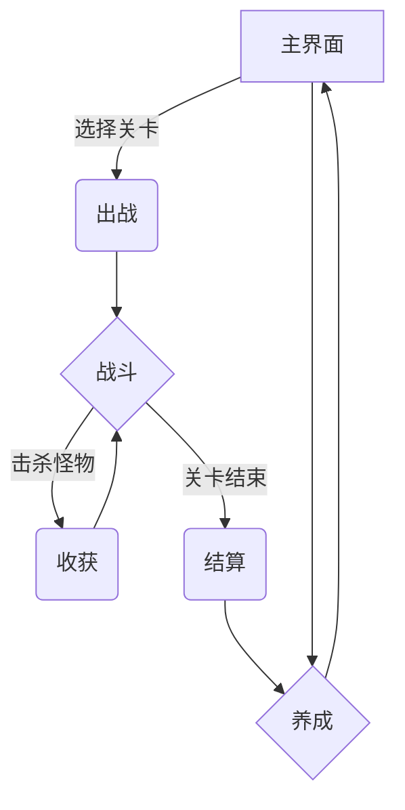
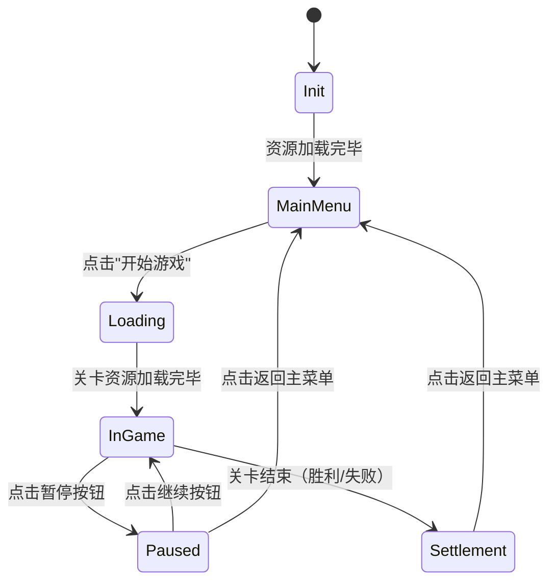
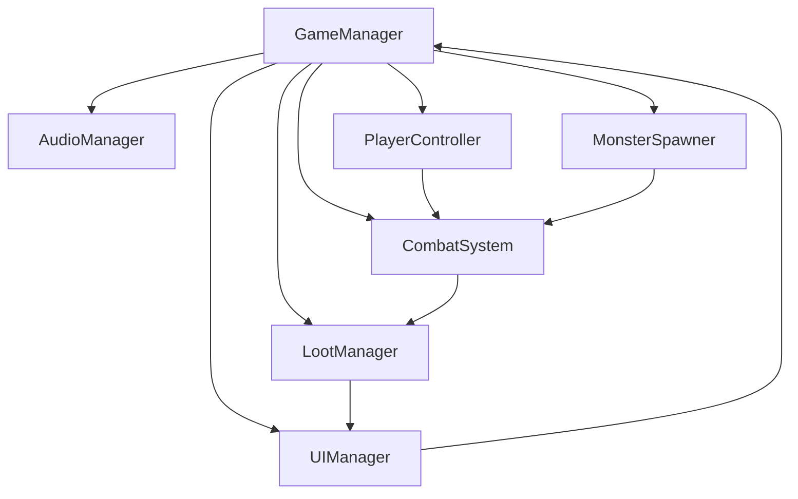

# 主策划案_《我叫MT之魔兽归来》_v3.2

> **版本**: 3.2  
> **日期**: 2026-01-30  
> **依据**:
> - 《00_项目基础规范》（游戏类型、屏幕、Unity、18 个 UI 清单唯一口径）
> - 《游戏生成的需求知识库 v2.2》
> - 《游戏设计的策划知识库 v2.2》
> - 《游戏开发美术知识库 v2.2》
> - 《游戏开发的程序知识库（Unity）v2.1.1》
> - 《参考游戏：迷雾大陆》

> **说明**:
> - 本文档为**主策划案**，定义游戏的核心设计、系统规则、游戏循环、功能描述
> - **UI详细设计**请参考《UI策划案_《我叫MT之魔兽归来》_v3.2.md》
> - **数值详细配置**请参考《数值策划案_《我叫MT之魔兽归来》_v3.2.md》
> - **交付包自包含与口径优先级**：见《交付文档/验收与口径.md》；文中若出现“基础知识库 v1.8”，仅为历史来源，不要求读取。

---

## 更新记录 (Changelog)

- **v3.2 (2026-01-30)**（知识库版本同步）:
  - 更新所有依据知识库的版本为v2.2
  - 同步需求知识库v2.2的UI系统完整性要求（18个UI界面）
  - 同步策划知识库v2.2的UI系统整体架构定义
  - 确认所有UI设计符合1080x1920竖屏规范
- **v3.1 (2026-01-30)**（知识库版本同步）:
  - 更新所有依据知识库的版本为v2.1
  - 同步《游戏基础规范》（第0章）的强制定义
  - 确认所有UI布局、屏幕方向、分辨率等基础规范符合v2.1要求
- **v3.0 (2026-01-30)**（策划案拆分重构）:
  - **重大更新**：根据《策划知识库 v2.2》的"策划案拆分规范"，将GDD v2.1拆分为主策划案、UI策划案、数值策划案
  - **主策划案定位**：保留游戏的核心设计、系统规则、游戏循环、功能描述
  - **移除内容**：UI的详细布局图（ASCII图示）→ 转移到《UI策划案_《我叫MT之魔兽归来》_v3.2.md》
  - **移除内容**：数值的详细配置（怪物配置表、装备配置表、掉落表配置表）→ 转移到《数值策划案_《我叫MT之魔兽归来》_v3.2.md》
  - **保留内容**：UI系统的"设计规范"和"原则"（告诉UI策划"应该怎么做"）
  - **保留内容**：数值的"设计框架"和"护栏"（告诉数值策划"数值应该在什么范围内"）
  - **参考标准**：基于《迷雾大陆》游戏分析，补充隐性知识和设计原则

---

## 目录

1. [游戏核心设定](#1-游戏核心设定)
2. [核心玩法与循环](#2-核心玩法与循环)
3. [核心系统设计框架](#3-核心系统设计框架)
4. [美术与音效需求约束](#4-美术与音效需求约束)
5. [完整美术资源清单](#5-完整美术资源清单)
6. [游戏流程与状态机](#6-游戏流程与状态机)
7. [UI系统设计规范](#7-ui系统设计规范)
8. [UI反馈系统设计规范](#8-ui反馈系统设计规范)
9. [系统间协作与数据流转](#9-系统间协作与数据流转)
10. [配置数据结构定义](#10-配置数据结构定义)
11. [游戏功能验收测试SOP](#11-游戏功能验收测试sop)

---

## 1. 游戏核心设定

### 1.1 项目基本信息

| 属性 | 值 |
|---|---|
| **工作名** | 我叫MT之魔兽归来 (WarcraftReturn) |
| **类型** | 单机、单人、小型刷刷刷 RPG |
| **平台** | 移动 (Android / iOS)，以抖音小游戏为主要目标平台 |
| **引擎** | Unity 2022.3.47f1 |
| **游戏模式** | 3D 游戏 |
| **屏幕** | 竖屏 (1080x1920) |
| **操作** | 单手（虚拟摇杆 + 技能按钮） |

### 1.2 游戏题材、世界观与美术风格

> **原则**: 这是所有美术和内容产出的最高"宪法"，后续所有设计（角色、场景、UI、文案）都必须严格遵守。

**核心题材**: 我叫MT之魔兽归来 (I am MT: Warcraft's Return)

**关键词**: 魔兽、刷怪、打宝、角色扮演、单机、小游戏

**世界观基调**: 轻度、幽默、致敬经典的魔兽世界。我们不是在做一个严肃宏大的史诗，而是一个让玩家能轻松体验"刷刷刷"乐趣的小游戏。

**核心冲突**: 玩家扮演的冒险者，在一个充满经典魔兽元素（如鱼人、狗头人、兽人）的世界中，通过不断战斗和成长，挑战更强大的敌人，获取更好的装备。

**美术风格**: 3D卡通渲染，具有PC/主机游戏的质感，而非低龄化的Q版风格。**场景与环境**遵循《游戏开发美术知识库 v2.2》主色调（低饱和度冷色）；**角色与 UI** 可色彩鲜明、饱和度适中，并与背景可读性区分。

**参考标准**: 《迷雾大陆》的美术风格（3D卡通渲染、暗黑奇幻、石质边框、金属装饰）

### 1.3 视角与操作模式

**视角**: 3D 第三人称视角，标准第三人称跟随相机，固定高度，相机轻微跟随玩家。

**相机类型**: 标准第三人称跟随（类似《魔兽世界》等 MMO），相机位于玩家后方偏上，可随玩家移动平滑跟随；不要求玩家手动旋转镜头。

**操作模式**:
- **移动**: 屏幕左下虚拟摇杆
- **普攻**: 自动攻击（进入攻击范围自动攻击最近敌人）
- **技能**: 屏幕右下 2～3 个技能按钮，点击释放，有冷却时间
- **拾取**: 靠近自动拾取

---

## 2. 核心玩法与循环

### 2.1 游戏定位与核心吸引力

> **原则**: 明确游戏的核心吸引力和目标玩家，是所有设计的基础。

**核心吸引力**:
1. **刷刷刷的爽快感**: 快节奏的战斗、大量的怪物、流畅的打击感
2. **装备掉落的惊喜感**: 随机掉落、品质分级、装备对比、即时穿戴
3. **角色成长的满足感**: 经验升级、属性提升、技能解锁、装备强化

**目标玩家**: 轻度到中度玩家，追求碎片时间的快速爽快体验，单局时长3-5分钟

**参考标准**: 《迷雾大陆》的核心吸引力（刷刷刷、装备掉落、角色成长）

### 2.2 高层核心循环



**核心循环说明**:

1. **出战**: 从主界面选择关卡，进入战斗场景
2. **战斗**: 进行实时战斗（自动普攻 + 手动技能 + 走位）
3. **收获**: 击杀怪物，获得金币、经验、装备
4. **结算**: 关卡结束（胜利或失败），进入结算界面
5. **养成**: 回到主界面，进行角色养成（升级、换装、升技能）
6. **循环**: 挑战更高难度的关卡

### 2.3 单局必备流程（胜利与失败）

任意一局游戏都必须具备明确的胜利和失败条件，以及对应的结算路径。

**胜利条件**: 击败关卡最终BOSS或完成指定任务目标（如存活特定时间）

**失败条件**: 玩家死亡且无法或选择不复活

**失败保留收益**: 即使失败，本局获得的经验、金币等基础产出也应按一定比例结算给玩家，确保"每局不白玩"。比例由配置定义（见第10章）：`exp_retain_ratio`（经验保留比例，建议 0.3～0.5）、`gold_retain_ratio`（金币保留比例，建议 0.3～0.5）；首版可在 `game_config.json` 或关卡配置中实现，默认建议均为 0.5。

---

## 3. 核心系统设计框架

### 3.1 战斗系统

#### 3.1.1 战斗系统趣味性依赖

> **原则**: 战斗体验的核心是正反馈循环。玩家的每一个动作都应得到及时、清晰、令人愉悦的反馈，以驱动他们持续战斗。

**打击感 (Hit Feedback)**:
- **视觉**: 怪物被击中时必须有明显的受击特效、短暂僵直或后退等表现
- **音效**: 每次攻击和受击都必须有对应的音效
- **特效**: 暴击、技能命中时应有更华丽的视觉特效（VFX）

**死亡反馈 (Death Feedback)**:
- **怪物死亡**: 怪物死亡时应有碎裂、消失或倒地等表现，并爆出金币和装备，这是最直接的奖励反馈
- **玩家死亡**: 玩家死亡时应有特殊的音效和屏幕效果（如屏幕变灰），以示警告

**节奏控制 (Pacing)**:
- **怪物分布**: 关卡中的怪物分布应有疏有密，形成"紧张-放松"的节奏
- **精英/BOSS战**: 在连续的普通战斗后，安排一场精英或BOSS战，作为阶段性的挑战和奖励节点

#### 3.1.2 基础属性与伤害公式

**基础属性**: HP（生命值）、Attack（攻击力）、Defense（防御力）、MoveSpeed（移动速度）、AttackSpeed（攻击速度）、CritChance（暴击率）、CritDamage（暴击伤害系数）

**基础伤害公式**:
```
基础伤害 = Attack * 技能倍率
减伤系数 = Defense / (Defense + 100)  // K常数暂定为100
最终伤害 = 基础伤害 * (1 - 减伤系数)
若暴击: 最终伤害 *= (1 + CritDamage)
```

**具体数值配置**: 请参考《数值策划案_《我叫MT之魔兽归来》_v3.2.md》

### 3.2 技能系统

#### 3.2.1 技能系统设计原则

**技能分类**:
- **主动技能 (Active Skill)**: 玩家手动点击释放，有冷却时间。分为伤害型、控制型、生存型
- **被动技能 (Passive Skill)**: 无需手动释放，提供常驻加成（属性光环）或满足条件自动触发（触发效果）

**设计边界**:
- **禁止**: 无冷却的强力技能、效果过于复杂的技能、毫无用处的技能
- **必须**: 至少一个AOE技能（保证刷怪效率）、一个生存技能（提高容错率）

#### 3.2.2 示例技能

**主动技能：多重箭**

| 属性 | 值 |
|---|---|
| **skill_id** | SK001 |
| **skill_name** | 多重箭 |
| **skill_type** | Active_Damage |
| **description** | 向前方扇形区域发射5支箭，每支造成80%攻击力的伤害 |
| **cooldown** | 8.0秒 |
| **parameters** | `{"arrow_count": 5, "damage_multiplier": 0.8, "aoe_shape": "cone", "aoe_range": 10.0, "aoe_angle": 60}` |
| **upgrade_effects** | `[{"level": 2, "description": "冷却时间减少1秒", "cooldown": -1.0}, {"level": 3, "description": "箭矢数量增加2支", "parameters.arrow_count": 2}]` |

**具体技能配置**: 请参考《数值策划案_《我叫MT之魔兽归来》_v3.2.md》

### 3.3 成长系统

**角色等级**: 击杀怪物获得经验，经验条满后升级，提升基础属性

**装备系统**: 核心成长线。通过战斗掉落获得，分为不同品质（普通、稀有、史诗、传说），提供大量属性加成

**装备槽位**: 6个装备槽位（武器、头盔、衣服、裤子、鞋子、饰品）

**装备品质**: 4种品质（灰色-普通、蓝色-稀有、紫色-史诗、橙色-传说）

**参考标准**: 《迷雾大陆》的装备系统（6个装备槽位、4种品质、颜色区分）

**具体装备配置**: 请参考《数值策划案_《我叫MT之魔兽归来》_v3.2.md》

### 3.4 关卡系统

**首版实现**: 线性主线关卡，共10关，逐步解锁

**关卡模板**: 包含若干波普通怪物和最终的BOSS或精英怪，时长控制在3-5分钟

**难度曲线**:
- **第1-3关**: 新手教学关卡，难度较低，引导玩家熟悉操作和系统
- **第4-7关**: 正常难度，挑战性适中，玩家需要合理使用技能和走位
- **第8-10关**: 高难度，需要玩家有较好的装备和技能搭配

**参考标准**: 《迷雾大陆》的关卡系统（10关逐步解锁、难度曲线、关卡选择界面）

**具体关卡配置**: 请参考《数值策划案_《我叫MT之魔兽归来》_v3.2.md》

### 3.5 数值设计框架

> **原则**: 为AI生成数值提供基于人类经验的边界，防止出现极端或无意义的数值，保证游戏的基本可玩性。

| 属性 | 范围/比例 |
|---|---|
| **单位对应** | 1 Unity单位 ≈ 1米 |
| **场景尺寸** | 核心战斗区域建议 **80x80 Unity单位**（对角线约113米，玩家以4米/秒移速移动对角线约需28秒；保证刷怪爽感和走位空间） |
| **玩家初始HP** | 100 ~ 200 |
| **玩家初始Attack** | 10 ~ 20 |
| **玩家初始Defense** | 5 ~ 15 |
| **玩家初始MoveSpeed** | 3 ~ 5 (米/秒) |
| **普通怪物HP** | 玩家HP的 0.5 ~ 1.5倍 |
| **BOSS HP** | 玩家HP的 5 ~ 10倍 |
| **怪物Attack** | 保证玩家能在承受5-10次攻击后才会死亡 |
| **每级属性增长** | 初始值的 5% ~ 10% |
| **装备属性加成** | 单件装备提供的核心属性不应超过玩家当前基础属性的50% |

**具体数值配置**: 请参考《数值策划案_《我叫MT之魔兽归来》_v3.2.md》

---

## 4. 美术与音效需求约束

> **原则**: 本章节定义"需要什么"，具体实现由《游戏开发美术知识库 v2.2》和《交付文档/音效最小规范与清单_v3.2.md》负责。

### 4.1 美术需求约束

**风格要求**: 必须严格遵循《游戏开发美术知识库 v2.2》中定义的"3D卡通渲染，轻度暗黑"风格

**关键表现**:
- **打击感**: 策划需要明确哪些技能需要强烈的打击感表现，美术AI需据此设计特效
- **死亡反馈**: 策划需要定义不同类型怪物的死亡表现（如普通怪物碎裂、精英怪物溶解、BOSS爆炸）

**参考标准**: 《迷雾大陆》的美术风格（3D卡通渲染、暗黑奇幻、石质边框、金属装饰）

### 4.2 音效需求约束

**风格要求**: 见《交付文档/音效最小规范与清单_v3.2.md》。首版可使用占位/复用音效，但必须不崩溃。

**首版最小音效清单**（资源名称、用途、触发时机，供程序/音效实现）:

| 资源ID/名称 | 用途 | 触发时机 |
|---|---|---|
| BGM_MainMenu | 主界面背景音乐 | 进入主界面 |
| BGM_Gameplay | 战斗场景背景音乐 | 进入 Gameplay 场景 |
| SFX_ButtonClick | 按钮点击 | 任意可点击按钮按下 |
| SFX_Attack | 普攻命中 | 玩家普攻命中怪物 |
| SFX_Hit | 受击 | 玩家或怪物受击 |
| SFX_Death_Monster | 怪物死亡 | 怪物死亡 |
| SFX_Death_Player | 玩家死亡 | 玩家死亡 |
| SFX_Skill | 技能释放 | 技能释放（可复用或按技能区分） |
| SFX_LevelUp | 升级 | 角色升级 |
| SFX_GoldPickup | 拾取金币 | 拾取金币 |

**完整清单与风格**: 首版以《交付文档/音效最小规范与清单_v3.2.md》为准；后续若建立更完整的音效知识库，可作为扩展文档补充，不影响首版验收。

---

## 5. 完整美术资源清单

> **重要说明**: 本章节是GDD的核心内容，包含了所有需要生成的美术资源的详细清单。本清单基于《参考游戏美术资源标准研究》和《迷雾大陆》分析，确保资源数量和质量符合行业标准。

### 资源类型与交付格式（强制约定）

| 资源类别 | 类型 | 交付格式 | 说明 |
|---|---|---|---|
| **角色 / 怪物** | 3D 模型 + 3D 动画 | 模型：`.fbx`（或 Unity 支持的 3D 格式）；动画：`.fbx` 内嵌或 `.anim` | 由美术提供可导入 Unity 的 3D 模型与动画，程序在场景中挂载与驱动 |
| **场景元素** | 3D 模型 | `.fbx` 或 Unity 支持的 3D 格式 | 地板、墙壁、装饰物、宝箱、火把等均为 3D 模型 |
| **UI 切图 / 图标** | 2D 贴图 | `.png`（尺寸见下表） | 按钮、图标、边框等 UI 用 2D 切图 |
| **UI 特效** | Unity Particle System | 不交付预制序列帧；可选提供粒子贴图 | 由程序在 Unity 内用 Particle System 实现，美术可提供贴图（如光点、烟雾图） |
| **战斗 / 技能特效** | 程序粒子或预制 VFX | Unity Particle System 或 预制体 + 贴图 | 命中、技能、死亡等特效由程序粒子或预制 VFX 实现，美术可提供贴图或参考 |

### 5.1 美术资源总览

| 资源大类 | 子类数量 | 说明 | 交付物形式 |
|---|---|---|---|
| 角色系统 | 1 个角色，6 组动画剪辑 | 玩家猎人 | 3D 模型（.fbx）+ 3D 动画（Idle/Move/Attack/Hit/Death/Skill） |
| 怪物系统 | 4 种怪物，各 5 组动画 | 鱼人、狗头人、兽人战士、兽人 BOSS | 3D 模型（.fbx）+ 3D 动画（Idle/Move/Attack/Hit/Death） |
| 场景系统 | 20 种元素 | 地板、墙壁、火把、宝箱、门、柱子、骷髅等 | 3D 模型（.fbx） |
| UI 系统 | 39 个独立元素 | 主界面 / 战斗 / 结算用切图与图标 | 2D 切图（.png） |
| 特效 | 战斗/技能 VFX | 命中、技能、死亡等 | Unity Particle System（+ 可选贴图）；UI 特效仅用 Particle System |
| **总计** | **95 个资源项** | - | 见上文「资源类型与交付格式」 |

### 5.2 角色系统美术资源清单

#### 5.2.1 玩家角色 - 猎人 (Player_Hunter)

**角色描述**:
- 3D卡通风格的猎人角色，手持弓箭
- 穿着皮革护甲，带有金属装饰
- Diablo 3 + Torchlight美术风格
- 色彩鲜艳，轮廓清晰

**动画资源清单（3D 模型 + 3D 动画）**:

| 资产ID | 资产名称 | 文件/剪辑命名 | 规格 | 用途 |
|---|---|---|---|---|
| CHAR_001_MODEL | 玩家猎人模型 | `Player_Hunter.fbx` | Unity 可导入 3D 模型 | 角色网格与骨骼 |
| CHAR_001_IDLE | 玩家待机动画 | 模型内嵌或 `Player_Hunter_Idle.anim` | 循环 | 待机呼吸 |
| CHAR_001_MOVE | 玩家移动动画 | `Player_Hunter_Move` | 循环 | 行走/跑动 |
| CHAR_001_ATTACK | 玩家攻击动画 | `Player_Hunter_Attack` | 单次 | 普攻，含判定帧 |
| CHAR_001_HIT | 玩家受击动画 | `Player_Hunter_Hit` | 单次 | 受击后仰/震动 |
| CHAR_001_DEATH | 玩家死亡动画 | `Player_Hunter_Death` | 单次 | 倒地，末帧可作尸体 |
| CHAR_001_SKILL | 玩家技能释放动画 | `Player_Hunter_Skill` | 单次 | 技能施放 |
| **小计** | - | **1 模型 + 6 动画剪辑** | - | - |

**美术要求**:
- 模型 Pivot/根节点在脚底中心，面向 +Z 或项目约定朝向
- 动画与模型骨骼一致，可嵌入同一 .fbx 或单独 .anim
- 攻击动画需标明或预留攻击判定帧（供程序事件调用）
- 受击、死亡动画需有明显后仰或倒地表现

### 5.3 怪物系统美术资源清单

#### 5.3.1 怪物通用动画规范（3D 模型 + 3D 动画）

**所有怪物都必须包含以下动画剪辑**:

| 动画类型 | 用途 | 备注 |
|---|---|---|
| 待机 (Idle) | 循环播放 | 轻微呼吸或摇摆 |
| 移动 (Move) | 循环播放 | 根据怪物类型（行走/爬行等） |
| 攻击 (Attack) | 单次播放 | 含攻击判定帧，供程序事件调用 |
| 受击 (Hit) | 单次播放 | 明显后仰或震动 |
| 死亡 (Death) | 单次播放 | 倒地，末帧可作尸体 |
| **每种怪物** | **1 模型 + 5 动画剪辑** | 交付 .fbx（可含动画）或 .anim |

#### 5.3.2 怪物1 - 鱼人 (Monster_Murloc)

**怪物描述**:
- 小型鱼人类人形生物，带有鳍和鳞片
- 手持简单的木矛
- 攻击性姿态
- 蓝绿色皮肤
- Diablo 3 + Torchlight美术风格

**动画资源清单（3D 模型 + 3D 动画）**:

| 资产ID | 资产名称 | 文件/剪辑命名 | 用途 |
|---|---|---|---|
| MON_101_MODEL | 鱼人模型 | `Monster_Murloc.fbx` | 角色网格与骨骼 |
| MON_101_IDLE | 鱼人待机 | 模型内嵌或单独剪辑 | 循环 |
| MON_101_MOVE | 鱼人移动 | 同上 | 循环 |
| MON_101_ATTACK | 鱼人攻击 | 同上 | 单次，含判定帧 |
| MON_101_HIT | 鱼人受击 | 同上 | 单次 |
| MON_101_DEATH | 鱼人死亡 | 同上 | 单次 |
| **小计** | - | **1 模型 + 5 动画剪辑** | - |

#### 5.3.3 怪物2 - 狗头人 (Monster_Kobold)

**怪物描述**:
- 小型犬类人形生物
- 戴着矿工头盔，头盔上有点燃的蜡烛
- 手持石头或岩石
- 胆怯但具有攻击性的姿态
- 棕色毛皮，橙色蜡烛光晕

**动画资源清单（3D 模型 + 3D 动画）**:

| 资产ID | 资产名称 | 文件/剪辑命名 | 用途 |
|---|---|---|---|
| MON_102_MODEL | 狗头人模型 | `Monster_Kobold.fbx` | 角色网格与骨骼 |
| MON_102_IDLE | 狗头人待机 | 模型内嵌或单独剪辑 | 循环 |
| MON_102_MOVE | 狗头人移动 | 同上 | 循环 |
| MON_102_ATTACK | 狗头人攻击 | 同上 | 单次，含判定帧 |
| MON_102_HIT | 狗头人受击 | 同上 | 单次 |
| MON_102_DEATH | 狗头人死亡 | 同上 | 单次 |
| **小计** | - | **1 模型 + 5 动画剪辑** | - |

#### 5.3.4 怪物3 - 兽人战士 (Monster_OrcWarrior)

**怪物描述**:
- 中型人形生物，肌肉发达
- 手持单手斧或锤
- 穿着简单的皮甲或布甲
- 绿色皮肤，獠牙外露
- 攻击性强，姿态威猛

**动画资源清单（3D 模型 + 3D 动画）**:

| 资产ID | 资产名称 | 文件/剪辑命名 | 用途 |
|---|---|---|---|
| MON_103_MODEL | 兽人战士模型 | `Monster_OrcWarrior.fbx` | 角色网格与骨骼 |
| MON_103_IDLE | 兽人战士待机 | 模型内嵌或单独剪辑 | 循环 |
| MON_103_MOVE | 兽人战士移动 | 同上 | 循环 |
| MON_103_ATTACK | 兽人战士攻击 | 同上 | 单次，含判定帧 |
| MON_103_HIT | 兽人战士受击 | 同上 | 单次 |
| MON_103_DEATH | 兽人战士死亡 | 同上 | 单次 |
| **小计** | - | **1 模型 + 5 动画剪辑** | - |

#### 5.3.5 怪物4 - 兽人BOSS (Monster_OrcBoss)

**怪物描述**:
- 大型人形生物，体型是普通兽人的1.5倍
- 手持双手巨斧
- 穿着重型板甲，带有骷髅装饰
- 深绿色皮肤，红色眼睛
- 威严的BOSS姿态

**动画资源清单（3D 模型 + 3D 动画）**:

| 资产ID | 资产名称 | 文件/剪辑命名 | 用途 |
|---|---|---|---|
| MON_104_MODEL | 兽人BOSS模型 | `Monster_OrcBoss.fbx` | 角色网格与骨骼 |
| MON_104_IDLE | 兽人BOSS待机 | 模型内嵌或单独剪辑 | 循环 |
| MON_104_MOVE | 兽人BOSS移动 | 同上 | 循环 |
| MON_104_ATTACK | 兽人BOSS攻击 | 同上 | 单次，含判定帧 |
| MON_104_HIT | 兽人BOSS受击 | 同上 | 单次 |
| MON_104_DEATH | 兽人BOSS死亡 | 同上 | 单次 |
| **小计** | - | **1 模型 + 5 动画剪辑** | - |

### 5.4 场景系统美术资源清单

**场景描述**: 地下城风格，石质墙壁和地板，火把照明，宝箱和骷髅装饰

**场景元素清单（3D 模型）**:

| 资产ID | 资产名称 | 文件命名 | 说明 |
|---|---|---|---|
| SCENE_001 | 地板_石板 | `Scene_Floor_Stone.fbx` | 可平铺的石质地板 |
| SCENE_002 | 墙壁_石墙 | `Scene_Wall_Stone.fbx` | 可拼接的石质墙壁 |
| SCENE_003 | 火把_墙壁 | `Scene_Torch_Wall.fbx` | 墙壁火把（带火光） |
| SCENE_004 | 火把_地面 | `Scene_Torch_Floor.fbx` | 地面火把（带火光） |
| SCENE_005 | 宝箱_木质 | `Scene_Chest_Wood.fbx` | 木质宝箱（可开启） |
| SCENE_006 | 宝箱_金属 | `Scene_Chest_Metal.fbx` | 金属宝箱（可开启） |
| SCENE_007 | 门_木门 | `Scene_Door_Wood.fbx` | 木门（可开启） |
| SCENE_008 | 门_铁门 | `Scene_Door_Iron.fbx` | 铁门（可开启） |
| SCENE_009 | 柱子_石柱 | `Scene_Pillar_Stone.fbx` | 石质柱子 |
| SCENE_010 | 骷髅_地面 | `Scene_Skull_Floor.fbx` | 地面骷髅装饰 |
| SCENE_011 | 骷髅_墙壁 | `Scene_Skull_Wall.fbx` | 墙壁骷髅装饰 |
| SCENE_012 | 石头_小 | `Scene_Rock_Small.fbx` | 小石头 |
| SCENE_013 | 石头_中 | `Scene_Rock_Medium.fbx` | 中石头 |
| SCENE_014 | 石头_大 | `Scene_Rock_Large.fbx` | 大石头 |
| SCENE_015 | 楼梯_上 | `Scene_Stairs_Up.fbx` | 上楼梯 |
| SCENE_016 | 楼梯_下 | `Scene_Stairs_Down.fbx` | 下楼梯 |
| SCENE_017 | 祭坛 | `Scene_Altar.fbx` | 祭坛（BOSS出现点） |
| SCENE_018 | 传送门 | `Scene_Portal.fbx` | 传送门（关卡入口/出口） |
| SCENE_019 | 吊灯 | `Scene_Chandelier.fbx` | 吊灯（带火光） |
| SCENE_020 | 旗帜 | `Scene_Banner.fbx` | 旗帜（装饰） |
| **小计** | **20 种场景元素** | - | - |

### 5.5 UI系统美术资源清单

**UI描述**: 暗黑奇幻风格，石质边框，金属装饰，按钮带高亮态

**UI切图清单（2D 贴图）**:

| 资产ID | 资产名称 | 文件命名 | 尺寸 | 说明 |
|---|---|---|---|---|
| UI_001 | 主界面背景 | `UI_MainMenu_Background.png` | 1080x1920 | 主界面背景图 |
| UI_002 | 按钮_正常态 | `UI_Button_Normal.png` | 400x120 | 按钮正常态 |
| UI_003 | 按钮_按下态 | `UI_Button_Pressed.png` | 400x120 | 按钮按下态 |
| UI_004 | 按钮_禁用态 | `UI_Button_Disabled.png` | 400x120 | 按钮禁用态 |
| UI_005 | 图标_金币 | `UI_Icon_Gold.png` | 64x64 | 金币图标 |
| UI_006 | 图标_经验 | `UI_Icon_Exp.png` | 64x64 | 经验图标 |
| UI_007 | 图标_设置 | `UI_Icon_Settings.png` | 100x100 | 设置图标 |
| UI_008 | 图标_暂停 | `UI_Icon_Pause.png` | 80x80 | 暂停图标 |
| UI_009 | 血条背景 | `UI_Gameplay_HPBar_Background.png` | 300x40 | 血条背景 |
| UI_010 | 血条填充 | `UI_Gameplay_HPBar_Fill.png` | 300x40 | 血条填充（红色） |
| UI_011 | 虚拟摇杆底座 | `UI_Gameplay_Joystick_Base.png` | 200x200 | 虚拟摇杆底座 |
| UI_012 | 虚拟摇杆摇杆 | `UI_Gameplay_Joystick_Stick.png` | 100x100 | 虚拟摇杆摇杆 |
| UI_013 | 技能按钮_多重箭 | `UI_Icon_Skill_MultiArrow.png` | 120x120 | 多重箭技能图标 |
| UI_014 | 技能按钮_闪避 | `UI_Icon_Skill_Dodge.png` | 120x120 | 闪避技能图标 |
| UI_015 | 技能按钮_治疗 | `UI_Icon_Skill_Heal.png` | 120x120 | 治疗技能图标 |
| UI_016 | 技能冷却遮罩 | `UI_Icon_Skill_Cooldown_Mask.png` | 120x120 | 技能冷却遮罩（半透明黑色） |
| UI_017 | 结算背景 | `UI_Settlement_Background.png` | 1080x1920 | 结算界面背景（半透明黑色） |
| UI_018 | 胜利标题 | `UI_Settlement_Victory.png` | 600x200 | 胜利标题 |
| UI_019 | 失败标题 | `UI_Settlement_Defeat.png` | 600x200 | 失败标题 |
| UI_020 | 奖励面板背景 | `UI_Settlement_RewardPanel.png` | 800x600 | 奖励面板背景 |
| UI_021 | 经验条背景 | `UI_Settlement_ExpBar_Background.png` | 600x40 | 经验条背景 |
| UI_022 | 经验条填充 | `UI_Settlement_ExpBar_Fill.png` | 600x40 | 经验条填充（黄色） |
| UI_023 | 装备槽_空 | `UI_Icon_EquipSlot_Empty.png` | 100x100 | 空装备槽 |
| UI_024 | 装备槽_已装备 | `UI_Icon_EquipSlot_Equipped.png` | 100x100 | 已装备槽 |
| UI_025 | 装备品质_普通 | `UI_Icon_Quality_Common.png` | 100x100 | 普通品质边框（灰色） |
| UI_026 | 装备品质_稀有 | `UI_Icon_Quality_Rare.png` | 100x100 | 稀有品质边框（蓝色） |
| UI_027 | 装备品质_史诗 | `UI_Icon_Quality_Epic.png` | 100x100 | 史诗品质边框（紫色） |
| UI_028 | 装备品质_传说 | `UI_Icon_Quality_Legendary.png` | 100x100 | 传说品质边框（橙色） |
| UI_029 | 装备图标_武器 | `UI_Icon_Equip_Weapon.png` | 100x100 | 武器图标 |
| UI_030 | 装备图标_头盔 | `UI_Icon_Equip_Helmet.png` | 100x100 | 头盔图标 |
| UI_031 | 装备图标_衣服 | `UI_Icon_Equip_Armor.png` | 100x100 | 衣服图标 |
| UI_032 | 装备图标_裤子 | `UI_Icon_Equip_Pants.png` | 100x100 | 裤子图标 |
| UI_033 | 装备图标_鞋子 | `UI_Icon_Equip_Boots.png` | 100x100 | 鞋子图标 |
| UI_034 | 装备图标_饰品 | `UI_Icon_Equip_Accessory.png` | 100x100 | 饰品图标 |
| UI_035 | 标签_新 | `UI_Tag_New.png` | 50x50 | "新"标签（红色） |
| UI_036 | 标签_可升级 | `UI_Tag_Upgradable.png` | 50x50 | "可升级"标签（绿色） |
| UI_037 | 箭头_向上_绿色 | `UI_Arrow_Up_Green.png` | 30x30 | 向上绿色箭头（属性提升） |
| UI_038 | 箭头_向下_红色 | `UI_Arrow_Down_Red.png` | 30x30 | 向下红色箭头（属性下降） |
| UI_039 | 感叹号_红色 | `UI_Exclamation_Red.png` | 30x30 | 红色感叹号（重要提示） |
| **小计** | **39 个UI切图** | - | - | - |

### 5.6 特效系统美术资源清单

**约定**: 所有游戏内特效（含战斗、技能、死亡、掉落、环境及 **UI 特效**）均由 **Unity Particle System** 在引擎内实现。美术不交付序列帧动画；可选择性提供粒子贴图（如光点、烟雾、闪光 .png）供 Particle System 使用。

#### 5.6.1 战斗/技能特效（Unity Particle System）

| 资产ID | 特效名称 | 实现方式 | 美术可选交付 | 用途 |
|---|---|---|---|---|
| VFX_HIT_NORMAL | 普攻命中 | Particle System | 火花/闪光贴图 | 单次播放 |
| VFX_SKILL_MULTIARROW | 多重箭技能 | Particle System | 箭矢/轨迹贴图 | 单次播放 |
| VFX_DEATH_MONSTER | 怪物死亡 | Particle System | 烟雾/碎片贴图 | 单次播放 |

**效果参考**: 命中—小型火花与闪光（橙黄）；多重箭—扇形箭矢与轨迹；死亡—碎裂与尘埃粒子。

#### 5.6.2 UI 特效（Unity Particle System）

| 资产ID | 特效名称 | 实现方式 | 美术可选交付 | 用途 |
|---|---|---|---|---|
| VFX_LEVELUP | 升级特效 | Particle System | 光效/星星贴图 | 单次播放 |

**效果参考**: 升级时角色周围金色光效与星星粒子，由程序在 Unity 内配置 Particle System 完成。

#### 5.6.3 掉落物/环境特效（Unity Particle System）

| 资产ID | 特效名称 | 实现方式 | 美术可选交付 | 用途 |
|---|---|---|---|---|
| VFX_DROP_GOLD | 金币掉落 | Particle System | 金色光点贴图 | 循环/单次 |
| VFX_DROP_* | 装备掉落光效（品质） | Particle System | 品质色光效贴图 | 循环/单次 |
| VFX_ENV_DUST | 环境灰尘 | Particle System | 灰尘贴图 | 循环 |

**特效系统总计**: 全部由 **Unity Particle System** 实现；美术可提供粒子贴图（.png），不交付序列帧。

### 5.7 美术资源清单总结

| 资源大类 | 交付形式 | 数量/说明 |
|---|---|---|
| 角色系统 | 3D 模型 + 3D 动画 | 1 角色模型 + 6 组动画剪辑 |
| 怪物系统 | 3D 模型 + 3D 动画 | 4 种怪物 ×（1 模型 + 5 动画剪辑）|
| 场景系统 | 3D 模型 | 20 种场景元素（地板、墙、道具等）|
| UI 系统 | 2D 切图 (.png) | 39 张独立 UI 切图/图标 |
| 特效系统 | Unity Particle System | 程序在引擎内实现；美术可提供粒子贴图（可选）|
| **总计** | **95 个资源项** | 见上文「资源类型与交付格式」 |

---

## 6. 游戏流程与状态机

### 6.1 游戏核心状态定义

游戏必须包含以下核心状态：

| 状态ID | 状态名称 | 描述 |
|---|---|---|
| `Init` | 初始化 | 游戏启动，加载基础资源 |
| `MainMenu` | 主界面 | 显示主菜单，玩家可进行关卡选择、角色养成等操作 |
| `Loading` | 加载中 | 进入关卡前的资源加载 |
| `InGame` | 游戏内 | 玩家进行战斗、探索等核心玩法 |
| `Paused` | 暂停 | 游戏暂停，显示暂停菜单 |
| `Settlement` | 结算 | 战斗结束，显示结算界面 |

### 6.2 游戏状态转换规则



**状态转换表**:

| 当前状态 | 触发条件 | 目标状态 |
|---|---|---|
| `Init` | 资源加载完毕 | `MainMenu` |
| `MainMenu` | 点击"开始游戏"按钮 | `Loading` |
| `Loading` | 关卡资源加载完毕 | `InGame` |
| `InGame` | 点击暂停按钮 | `Paused` |
| `Paused` | 点击继续按钮 | `InGame` |
| `Paused` | 点击返回主菜单按钮 | `MainMenu` |
| `InGame` | 关卡结束（胜利/失败） | `Settlement` |
| `Settlement` | 点击返回主菜单按钮 | `MainMenu` |

### 6.3 玩家体验路径

**完整的玩家体验路径描述**:

1. 玩家启动游戏，进入`Init`状态，游戏加载基础资源
2. 加载完成后，自动进入`MainMenu`状态，显示主界面
3. 玩家在主界面点击"开始游戏"按钮，进入`Loading`状态
4. 加载完成后，进入`InGame`状态，玩家开始战斗
5. 玩家在关卡中移动、攻击、释放技能，击杀怪物
6. 玩家击杀所有怪物和BOSS，达成胜利条件，进入`Settlement`状态
7. 玩家在结算界面查看奖励，点击"返回主菜单"按钮，进入`MainMenu`状态
8. 玩家可以继续选择下一个关卡，重复步骤3-7

### 6.4 场景相机与渲染强制要求（程序必遵）

> **原则**: 任何可进入的场景必须有至少一台启用相机与一个 AudioListener，否则会出现「No cameras rendering」黑屏或无声。

| 场景 | 强制要求 | 说明 |
|------|----------|------|
| **MainMenu** | 至少 1 台 **Camera**（启用）、1 个 **AudioListener**（启用） | 主菜单为纯 UI 时，相机可固定视角、ClearFlags 为 SolidColor 或 Skybox；背景色建议深色以配合暗黑风格 |
| **Gameplay** | 至少 1 台 **Camera**（启用）、1 个 **AudioListener**（启用） | 战斗场景相机为第三人称跟随（GDD 1.3）；可与 Cinemachine 或自定义跟随脚本配合 |

**验收**: 运行主菜单与战斗场景时，画面正常渲染、无「No cameras rendering」提示；音效可播（需场景内有 AudioListener）。

---

## 7. UI系统设计规范

> **说明**: 本章节定义UI系统的"设计规范"和"原则"，告诉UI策划"应该怎么做"。**UI的详细布局图（ASCII图示）**请参考《UI策划案_《我叫MT之魔兽归来》_v3.2.md》。

### 7.1 UI 视觉参考与期望效果（对齐需求）

> **说明**: 以下为与策划/需求方确认的**期望视觉效果方向**，供美术与程序实现时对齐；具体资源以 GDD 第 5 章清单为准。

| 界面 | 期望风格要点 | 与 GDD 结构关系 |
|------|--------------|-----------------|
| **主界面** | 暗黑奇幻、深色石质/金属边框；中央游戏 Logo 或标题区；按钮为「开始游戏 / 继续 / 设置 / 退出」等，可带金属框与高亮态；整体竖屏、信息层级清晰 | 对应 GDD 7.2.1 元素与布局；美术可参考同类暗黑风主菜单 |
| **战斗界面** | 左上角色信息（头像、血条、资源条）；右上金币等；左下虚拟摇杆、右下技能按钮；地下城/石质氛围、与主菜单风格统一 | 对应 GDD 7.2.2 血条/金币/摇杆/技能；视角为 GDD 1.3 第三人称 |
| **结算界面** | 中央「胜利/失败」标题；奖励面板（金币、经验、装备槽位、经验条与等级）；底部「继续 / 重试 / 返回城镇」按钮；暗色背景与边框、与主菜单风格统一 | 对应 GDD 7.2.3 奖励展示与按钮语义 |

实现时**优先保证功能与 GDD 7.2 结构一致**；视觉风格可先占位，再按上述要点与美术资源迭代。

**参考标准**: 《迷雾大陆》的UI设计（暗黑奇幻、石质边框、金属装饰、信息分区清晰）

### 7.2 UI界面结构定义

#### 7.2.1 主界面 (UIMainMenu)

**界面ID**: `UIMainMenu`  
**界面名称**: 主界面  
**界面层级**: 主界面层 (Main)

**UI元素列表**:

| 元素ID | 元素类型 | 功能描述 |
|---|---|---|
| `_Text_PlayerName` | Text | 显示玩家昵称 |
| `_Text_Gold` | Text | 显示当前金币数 |
| `_Image_GoldIcon` | Image | 金币图标 |
| `_Button_Settings` | Button | 打开设置界面 |
| `_Button_Start` | Button | 进入关卡选择 |
| `_Button_Continue` | Button | 继续上次进度 |
| `_Button_Inventory` | Button | 打开背包界面 |
| `_Button_Quit` | Button | 退出游戏 |

**UI详细布局图**: 请参考《UI策划案_《我叫MT之魔兽归来》_v3.2.md》

#### 7.2.2 战斗界面 (UIGameplay)

**界面ID**: `UIGameplay`  
**界面名称**: 战斗界面  
**界面层级**: 主界面层 (Main)

**UI元素列表**:

| 元素ID | 元素类型 | 功能描述 |
|---|---|---|
| `_Image_PlayerHP_BG` | Image | 血条背景 |
| `_Image_PlayerHP_Fill` | Image | 血条填充 |
| `_Text_Gold` | Text | 显示当前金币数 |
| `_Image_GoldIcon` | Image | 金币图标 |
| `_Button_Pause` | Button | 暂停游戏 |
| `_Joystick_Move` | Joystick | 虚拟摇杆 |
| `_Button_Skill1` | Button | 技能1按钮 |
| `_Button_Skill2` | Button | 技能2按钮 |

**UI详细布局图**: 请参考《UI策划案_《我叫MT之魔兽归来》_v3.2.md》

#### 7.2.3 结算界面 (UISettlement)

**界面ID**: `UISettlement`  
**界面名称**: 结算界面  
**界面层级**: 弹窗层 (Popup)

**UI元素列表**:

| 元素ID | 元素类型 | 功能描述 |
|---|---|---|
| `_Image_Background` | Image | 半透明黑色背景 |
| `_Image_Title` | Image | 胜利/失败标题 |
| `_Panel_Reward` | Panel | 奖励面板背景 |
| `_Text_Gold` | Text | 显示获得的金币 |
| `_Text_Exp` | Text | 显示获得的经验 |
| `_Image_ExpBar_BG` | Image | 经验条背景 |
| `_Image_ExpBar_Fill` | Image | 经验条填充 |
| `_Button_Continue` | Button | 胜利时进入下一关（若有）或返回主菜单；失败时不显示或灰显 |
| `_Button_Retry` | Button | 重新挑战当前关卡 |
| `_Button_Home` | Button | 返回主菜单（与状态机「返回主菜单」同义，文案保留「返回城镇」以符合世界观） |

**UI详细布局图**: 请参考《UI策划案_《我叫MT之魔兽归来》_v3.2.md》

### 7.3 UI交互逻辑

#### 7.3.1 技能按钮的交互逻辑

| 交互类型 | 触发条件 | 行为 |
|---|---|---|
| 点击 | 技能冷却完毕 | 释放技能，播放技能动画，进入冷却状态 |
| 点击 | 技能冷却中 | 播放"无法释放"的提示音效 |
| 视觉反馈 | 技能冷却中 | 技能按钮显示冷却遮罩和倒计时文本 |
| 视觉反馈 | 技能冷却完毕 | 技能按钮恢复正常状态，可能有闪光效果 |

#### 7.3.2 按钮的通用交互逻辑

| 交互类型 | 触发条件 | 行为 |
|---|---|---|
| 点击 | 按钮可用 | 执行按钮功能，播放点击音效 |
| 点击 | 按钮禁用 | 无反应 |
| 视觉反馈 | 按下 | 按钮显示按下态 |
| 视觉反馈 | 释放 | 按钮恢复正常态 |

### 7.4 UI状态管理

**UI状态机**: UI系统应该有一个清晰的状态机，管理不同UI界面的显示和隐藏

**UI堆栈**: UI系统应该有一个UI堆栈，管理UI界面的层级关系（如弹窗覆盖主界面）

**UI切换动画**: UI界面切换时应该有平滑的动画效果（如淡入淡出、缩放、滑动）

**UI详细设计**: 请参考《UI策划案_《我叫MT之魔兽归来》_v3.2.md》

---

## 8. UI反馈系统设计规范

> **说明**: 本章节定义UI反馈系统的"设计规范"和"原则"，告诉UI策划"应该怎么做"。**UI反馈的详细参数**请参考《UI策划案_《我叫MT之魔兽归来》_v3.2.md》。

### 8.1 UI反馈的设计原则

**及时性**: UI反馈必须在玩家操作后立即响应（< 100ms）

**清晰性**: UI反馈必须清晰明确，让玩家能够快速理解发生了什么

**一致性**: 相同类型的操作应该有相同的UI反馈

**愉悦性**: UI反馈应该让玩家感到愉悦，而不是烦躁

### 8.2 UI反馈的类型

**视觉反馈**: 颜色变化、大小变化、位置变化、透明度变化、动画效果

**音效反馈**: 按钮点击音效、操作成功音效、操作失败音效、提示音效

**触觉反馈**: 震动反馈（移动设备）

### 8.3 UI反馈的应用场景

**按钮点击**: 按钮按下态、点击音效、可选震动反馈

**技能释放**: 技能按钮冷却遮罩、冷却倒计时、技能释放音效

**属性变化**: 血条变化动画、金币变化动画、经验条变化动画

**物品获得**: 物品图标飞入背包动画、获得音效、"新"标签

**升级**: 升级特效、升级音效、属性提升动画

**UI详细设计**: 请参考《UI策划案_《我叫MT之魔兽归来》_v3.2.md》

---

## 9. 系统间协作与数据流转

### 9.1 核心系统协作关系



**系统协作说明**:

- **GameManager**: 游戏的核心管理器，负责游戏状态管理、场景切换、事件分发
- **UIManager**: UI管理器，负责UI界面的显示和隐藏、UI状态管理
- **AudioManager**: 音频管理器，负责背景音乐和音效的播放
- **PlayerController**: 玩家控制器，负责玩家的移动、攻击、技能释放
- **MonsterSpawner**: 怪物生成器，负责怪物的生成和管理
- **CombatSystem**: 战斗系统，负责伤害计算、战斗逻辑
- **LootManager**: 掉落管理器，负责掉落物的生成和拾取

### 9.2 事件系统

**事件驱动架构**: 游戏应该使用事件驱动架构，通过事件系统实现系统间的解耦

**核心事件列表**:

| 事件ID | 事件名称 | 触发时机 | 监听者 |
|---|---|---|---|
| `GAME_STATE_CHANGED` | 游戏状态变化 | GameManager状态切换时 | UIManager, AudioManager |
| `PLAYER_HEALTH_CHANGED` | 玩家血量变化 | 玩家受到伤害或治疗时 | UIManager |
| `PLAYER_GOLD_CHANGED` | 玩家金币变化 | 玩家获得或消耗金币时 | UIManager |
| `PLAYER_EXP_CHANGED` | 玩家经验变化 | 玩家获得经验时 | UIManager |
| `PLAYER_LEVEL_UP` | 玩家升级 | 玩家经验满时 | UIManager, AudioManager |
| `PLAYER_KILLED` | 玩家死亡 | 玩家血量归零时 | GameManager, UIManager, AudioManager |
| `MONSTER_KILLED` | 怪物死亡 | 怪物血量归零时 | LootManager, MonsterSpawner |
| `SKILL_USED` | 技能使用 | 玩家释放技能时 | CombatSystem, AudioManager |
| `ITEM_PICKED_UP` | 物品拾取 | 玩家拾取物品时 | UIManager, AudioManager |
| `LEVEL_COMPLETED` | 关卡完成 | 玩家击败所有怪物时 | GameManager |
| `LEVEL_FAILED` | 关卡失败 | 玩家死亡时 | GameManager |

### 9.3 数据流转

**配置数据**: 从JSON配置文件加载到ConfigManager，然后分发到各个系统

**玩家数据**: 从PlayerStats读取，通过事件系统通知UI更新

**怪物数据**: 从MonsterStats读取，通过CombatSystem计算伤害

**掉落数据**: 从LootTable读取，通过LootManager生成掉落物

---

## 10. 配置数据结构定义

> **说明**: 本章节定义配置数据的"数据结构"（JSON格式），但**不包含具体的数值配置**。**具体的数值配置**请参考《数值策划案_《我叫MT之魔兽归来》_v3.2.md》。

### 10.1 游戏配置 (game_config.json)

```json
{
  "game_version": "string",
  "exp_retain_ratio": "float (0.0 ~ 1.0)",
  "gold_retain_ratio": "float (0.0 ~ 1.0)",
  "auto_save_interval": "int (秒)"
}
```

**具体数值配置**: 请参考《数值策划案_《我叫MT之魔兽归来》_v3.2.md》

### 10.2 怪物配置 (monsters.json)

```json
{
  "monsters": [
    {
      "monster_id": "int",
      "monster_name": "string",
      "monster_type": "string",
      "base_hp": "int",
      "base_attack": "int",
      "base_defense": "int",
      "move_speed": "float",
      "attack_speed": "float",
      "attack_range": "float",
      "exp_reward": "int",
      "gold_reward": "int"
    }
  ]
}
```

**具体数值配置**: 请参考《数值策划案_《我叫MT之魔兽归来》_v3.2.md》

### 10.3 装备配置 (equipments.json)

```json
{
  "equipments": [
    {
      "equip_id": "int",
      "equip_name": "string",
      "equip_type": "string (Weapon/Helmet/Armor/Pants/Boots/Accessory)",
      "quality": "string (Common/Rare/Epic/Legendary)",
      "level_requirement": "int",
      "hp_bonus": "int",
      "attack_bonus": "int",
      "defense_bonus": "int",
      "crit_chance_bonus": "float",
      "crit_damage_bonus": "float"
    }
  ]
}
```

**具体数值配置**: 请参考《数值策划案_《我叫MT之魔兽归来》_v3.2.md》

### 10.4 技能配置 (skills.json)

```json
{
  "skills": [
    {
      "skill_id": "string",
      "skill_name": "string",
      "skill_type": "string (Active_Damage/Active_Control/Active_Survival/Passive)",
      "description": "string",
      "cooldown": "float (秒)",
      "parameters": "object"
    }
  ]
}
```

**具体数值配置**: 请参考《数值策划案_《我叫MT之魔兽归来》_v3.2.md》

### 10.5 关卡配置 (levels.json)

```json
{
  "levels": [
    {
      "level_id": "int",
      "level_name": "string",
      "difficulty": "string (Easy/Normal/Hard)",
      "waves": [
        {
          "wave_id": "int",
          "monsters": [
            {
              "monster_id": "int",
              "count": "int",
              "spawn_points": "array of Vector3"
            }
          ]
        }
      ],
      "boss": {
        "monster_id": "int",
        "spawn_point": "Vector3"
      }
    }
  ]
}
```

**具体数值配置**: 请参考《数值策划案_《我叫MT之魔兽归来》_v3.2.md》

### 10.6 掉落表配置 (loot_tables.json)

```json
{
  "loot_tables": [
    {
      "loot_table_id": "int",
      "loot_table_name": "string",
      "drops": [
        {
          "item_type": "string (Gold/Equip)",
          "item_id": "int (装备ID，金币时为0)",
          "drop_chance": "float (0.0 ~ 1.0)",
          "min_count": "int",
          "max_count": "int"
        }
      ]
    }
  ]
}
```

**具体数值配置**: 请参考《数值策划案_《我叫MT之魔兽归来》_v3.2.md》

---

## 11. 游戏功能验收测试SOP

> **原则**: 所有测试用例都必须通过，才能认为游戏功能完成。

### 11.1 测试用例清单

| 测试ID | 测试名称 | 前置条件 | 测试步骤 | 预期结果 | 优先级 |
|---|---|---|---|---|---|
| TC-GAMEPLAY-001 | 核心战斗循环 | 玩家位于主界面 | 1. 点击"开始游戏"按钮<br>2. 点击"第一关"<br>3. 在场景中移动摇杆<br>4. 接近并击杀一个怪物<br>5. 拾取掉落物<br>6. 击杀最终BOSS<br>7. 在结算界面点击"返回主城" | 1. 界面切换到关卡选择<br>2. 成功加载Gameplay场景<br>3. 玩家角色正常移动<br>4. 怪物播放受击和死亡动画，并掉落物品<br>5. 物品消失，玩家背包或属性变化<br>6. 弹出胜利结算界面<br>7. 成功返回主界面 | 高 |
| TC-UI-001 | 主界面UI | 游戏启动完成 | 1. 点击"设置"按钮<br>2. 拖动音量滑块<br>3. 点击"关闭"按钮 | 1. 弹出设置面板<br>2. 背景音乐音量变化<br>3. 设置面板关闭 | 高 |
| TC-SKILL-001 | 技能释放 | 玩家在战斗场景，技能冷却完毕 | 1. 点击"技能1"按钮 | 1. 玩家播放技能动画<br>2. 产生对应的技能效果（如多重箭/投射物/扇形AOE）<br>3. 技能按钮进入冷却倒计时状态 | 高 |
| TC-DEATH-001 | 玩家死亡与失败结算 | 玩家在战斗场景 | 1. 控制玩家持续受到怪物攻击直至HP归零 | 1. 玩家播放死亡动画，派发 PLAYER_KILLED，GameManager 派发 LEVEL_FAILED<br>2. 弹出失败结算界面，显示本局保留收益（按配置比例）<br>3. 玩家可点击「重试」或「返回主菜单」 | 高 |
| TC-ANIMATION-001 | 角色动画 | 玩家在战斗场景 | 1. 不移动摇杆，观察玩家角色<br>2. 移动摇杆，观察玩家角色<br>3. 点击技能按钮，观察玩家角色 | 1. 玩家播放待机动画（循环）<br>2. 玩家播放移动动画（循环）<br>3. 玩家播放技能释放动画（单次） | 高 |
| TC-EQUIP-001 | 装备系统 | 玩家在战斗或主界面，背包中有可穿戴装备 | 1. 打开背包/装备界面<br>2. 点击一件未穿戴装备的「穿戴」按钮<br>3. 关闭界面，查看属性面板 | 1. 装备界面正确显示装备列表与当前穿戴<br>2. 装备穿戴成功，属性面板数值更新<br>3. 属性与配置一致 | 高 |
| TC-LOOT-001 | 掉落系统 | 玩家在战斗场景 | 1. 击杀一个普通怪物<br>2. 靠近掉落物（若有）<br>3. 观察背包/金币/经验变化 | 1. 怪物死亡后按掉落表生成掉落物（金币/装备等）<br>2. 靠近后自动拾取或点击拾取<br>3. 背包/金币/经验正确增加 | 高 |
| TC-LEVEL-001 | 关卡系统 | 玩家位于主界面 | 1. 点击「开始游戏」<br>2. 选择指定关卡<br>3. 进入战斗后观察波次刷怪 | 1. 进入关卡选择界面<br>2. 正确加载对应关卡场景与配置<br>3. 按关卡配置的波次与刷怪点生成怪物 | 高 |
| TC-VICTORY-001 | 关卡胜利与结算 | 玩家在战斗场景，已生成所有波次与BOSS | 1. 击杀所有怪物（含BOSS）或满足关卡胜利条件 | 1. 触发 LEVEL_COMPLETED<br>2. GameManager 进入 Settlement<br>3. 弹出胜利结算界面并可返回主菜单 | 高 |
| TC-CONFIG-001 | 配置加载 | 游戏启动完成 | 1. 进入主界面<br>2. 进入任意关卡<br>3. 检查怪物种类与数值 | 1. 关卡/怪物/装备等配置正确加载<br>2. 关卡内怪物与配置一致<br>3. 数值符合配置（如血量、攻击力） | 高 |
| TC-EVENT-001 | 事件系统 | 游戏运行中 | 1. 玩家受到伤害<br>2. 击杀怪物<br>3. 穿戴装备 | 1. 血条/UI 随 HEALTH_CHANGED 等事件刷新<br>2. 掉落系统响应 MONSTER_KILLED<br>3. UI 随 INVENTORY_UPDATED 刷新 | 高 |
| TC-DAMAGE-001 | 伤害计算 | 玩家在战斗场景，已知双方属性 | 1. 玩家普攻命中怪物一次<br>2. 记录怪物血量变化 | 1. 伤害值符合策划公式（攻击、防御、暴击等）<br>2. 暴击时伤害系数正确 | 高 |
| TC-CAMERA-001 | 相机系统 | 玩家在战斗场景 | 1. 移动摇杆使玩家移动<br>2. 观察相机与玩家相对位置 | 1. 相机保持第三人称跟随<br>2. 相机平滑跟随，不穿墙（若有碰撞检测） | 高 |

**TC-CONFIG-001 自动化可执行标准**: 自动化时可通过 ConfigManager 读取关卡/怪物/装备配置，与场景中怪物实例的 MonsterStats（或配置 ID）及当前 HP/攻击力等数值做对比；**至少校验 1 个怪物 ID 与 1 项数值（如 HP）与配置一致**，即可视为通过。

---

## 结语

本主策划案 **v3.2** 是基于（历史来源：《基础知识库 v1.8》）《游戏生成的需求知识库 v2.2》《游戏设计的策划知识库 v2.2》《游戏开发美术知识库 v2.2》《游戏开发的程序知识库（Unity）v2.1.1》以及《参考游戏：迷雾大陆》整理生成的；首版执行口径以《交付文档/验收与口径.md》与《00_项目基础规范》为准。

**主策划案 v3.2 的核心定位**:
1. **定义游戏的核心设计**: 系统规则、游戏循环、功能描述
2. **定义UI系统的设计规范**: 告诉UI策划"应该怎么做"
3. **定义数值的设计框架**: 告诉数值策划"数值应该在什么范围内"
4. **不包含UI详细布局图**: 转移到《UI策划案_《我叫MT之魔兽归来》_v3.2.md》
5. **不包含数值详细配置**: 转移到《数值策划案_《我叫MT之魔兽归来》_v3.2.md》

**下一步**:
1. 根据本主策划案与知识库版本（v2.2）校准 UI/数值策划案的落地内容
2. 以《UI策划案_《我叫MT之魔兽归来》_v3.2.md》与 `UI效果图/` 为准实现 UI
3. 以《数值策划案_《我叫MT之魔兽归来》_v3.2.md》为准生成配置与数值
4. 根据《数值策划案_《我叫MT之魔兽归来》_v3.2.md》绘制关卡设计图（可后置）
5. （可选）生成《AI美术工作指南》《AI程序工作指南》（以 v3.2 口径）

---

**文档维护**: AI策划团队  
**最后更新**: 2026-01-30
